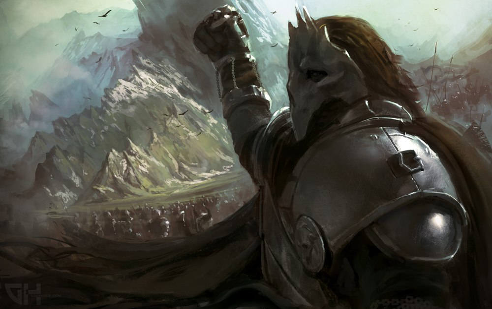

# Персонажи

## Виглаф

### Военачальник северного альянса.

Виглаф Магнусон

Один из самых влиятельных и могущественных Вождей Нордстронга, верховный правитель Магнархейма, Раймхола и Виммара,
Владение Магнархейм (с нортунгмола "Великий Чертог") - это независимый край, веками передающийся по наследству в роду легендарного героя Севера - Магнуса. Магнус был одним из тех Вождей, что в неспокойные времена, наставшие после падения Мирродина, стал оплотом стабильности и силы для своего народа. И чьи деяния определили привычный ныне облик Крайнего Севера.
Кровь героя оказалась столь сильна, что и многие века спустя, его потомки по-прежнему завоёвывают непревзойдённые почёт и известность, достойные славного предка. Традиция этого рода повелевает двум старшим сыновьям в каждом поколении носить имя потомка легендарного предка, независимо от того, как звали их собственного отца - так поддерживается память о славном прошлом семьи.

В настоящее время, Виглаф Магнусон - верховный главнокомандующий всеми силами Альянса на войне с Королевством Двенадцати. Потомок Магнуса - один из немногих, кто не участвовал во всеобщем переделе власти, происходившем в период восхождения Аларика. Он добровольно присягнул на верность Королю Кракену, к тому же склонив и подконтрольные ему кланы. Так же он отказался и от своих титулов, отдав право управлять своими бывшими Владениями общине Гватланд. Такая безоговорочная поддержка и преданность Виглафа оказали Аларику неоценимую помощь в его становлении Королём Нордстронга.

И это решение пришлось по нраву далеко не всем. Брат Виглафа, Атли Магнусон, отказался признавать за своим братом право Так распоряжаться родовой собственностью и узурпировал власть в Магнархейме. Все кланы этого края поддержали Атли, отказавшись подчиняться чужаку, не принадлежащему к кровной линии легендарного Магнуса. Ныне это одна из немногих независимых областей на территории Альянса, до сих пор не покорившаяся Королю Кракену.

Не смотря на столь решительные шаги в поддержку Короля Аларика, многие считают старшего Магнусона возможным соперником правителя. Виглафа поддерживает более четверти кланов Нордстронга, и земли многих из них отошли общинам Короля. Каллардцы хорошо знают Магнусона, как великолепного стратега и тактика, отважного и свирепого воина, а так же как харизматичного лидера и достойного человека. Сам Князь Харвинг - считающийся одним из самых искусных воителей Севера - бился с ним в поединке, окончившимся перемирием и многочисленными ранами у обоих бойцов. Виглаф во многом превосходит своего правителя, а обычаи Крайнего Севера не терпят власти слабого над сильным.

В Двенадцати Княжествах так же распространён слух, что Виглаф нарочно затягивает войну, ибо, располагая столь значительно превосходящими силами и обладая такими талантами и популярностью, он давно смог бы прорвать линию обороны северян и сокрушить их армии одним решительным блицкригом.