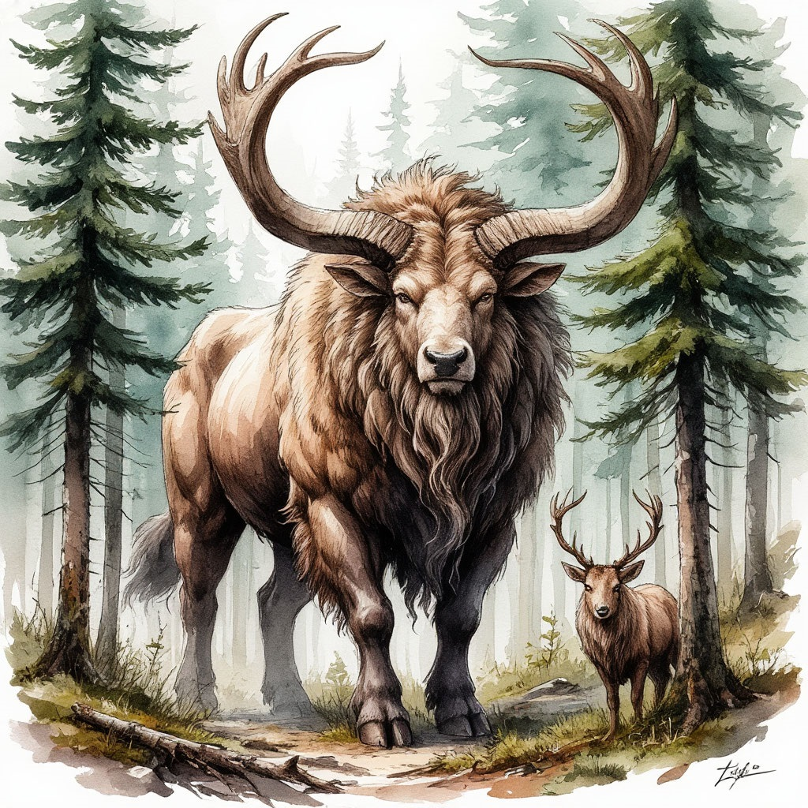

Гигантские оленеподобные существа, обитающие, преимущественно, на территории северного Пояса континента. Рост взрослых особей в холке может достигать почти трёх метров, при весе до полутора тонн.

Как и прочие представители мегафауны Мэйна, аэлхи стараются держаться вблизи эфирных источников и проходов в иные Планы. Первородный эфир наполняет подобных существ силой, продляет срок их жизни и наделяет особыми способностями, в том числе и выдающимися размерами.

Согласно мифам ульфов и урсов, первым аэлхом стало существо по имени Арн, созданное Богом-Зверем. Арн был священной жертвой, подаренной Отцом Зверей своим хищным детям. Кровь первого аэлха напитала леса Харлага, взрастив из себя великое многообразие жизни. А дух рогатого животного обрёл божественность, став одним из предводителей Гона Зверя, и могущественным покровителем не-хищных созданий.

Аэлхи обладают прочной шкурой, ценящейся охотниками за тёплый мягкий мех и простоту выделки, а также огромными ветвистыми рогами, достигающими в размахе до трёх с половиной метров. Кроме того, особую ценность представляет кровь аэлхов, являющаяся основой для многих целебных снадобий.

В разных культурах севера аэлхи занимают неизменно высокое положение среди божественно-рождённых созданий. Нордары считают этих существ идеалом упорства, жизнестойкости и природной мудрости. Несмотря на то, что у северных кланов нет никаких табу, связанных с охотой, они стараются поддерживать популяции диких аэлхов, не допуская их полного истребления на своих территориях. Кроме того, именно северянам удалось впервые приручить этих существ, впоследствии распространив стада домашних аэлхов по окружающим землям.

На прародине аэлхов, в Земле Зверя, гигантские олени считаются священной добычей. Ульфы держат под строжайшим запретом массовый промысел этих животных, позволяя убивать их лишь в ходе особых священнодействий, когда зверолюди Харлага бросают вызов этим могучим созданиям, не имея при себе одежды и оружия. Также высокая популяция аэлхов на полуострове необходима для поддержания численности мега-хищников, обитающих в местных лесах.

Таллардские урсы считают аэлхов примером отваги и жертвенности. Многие знатные дома Княжества носят их изображения в качестве своих гербов, а местные оленеводы считаются элитой среди животноводов, наряду с заводчиками гигантских медведей.
