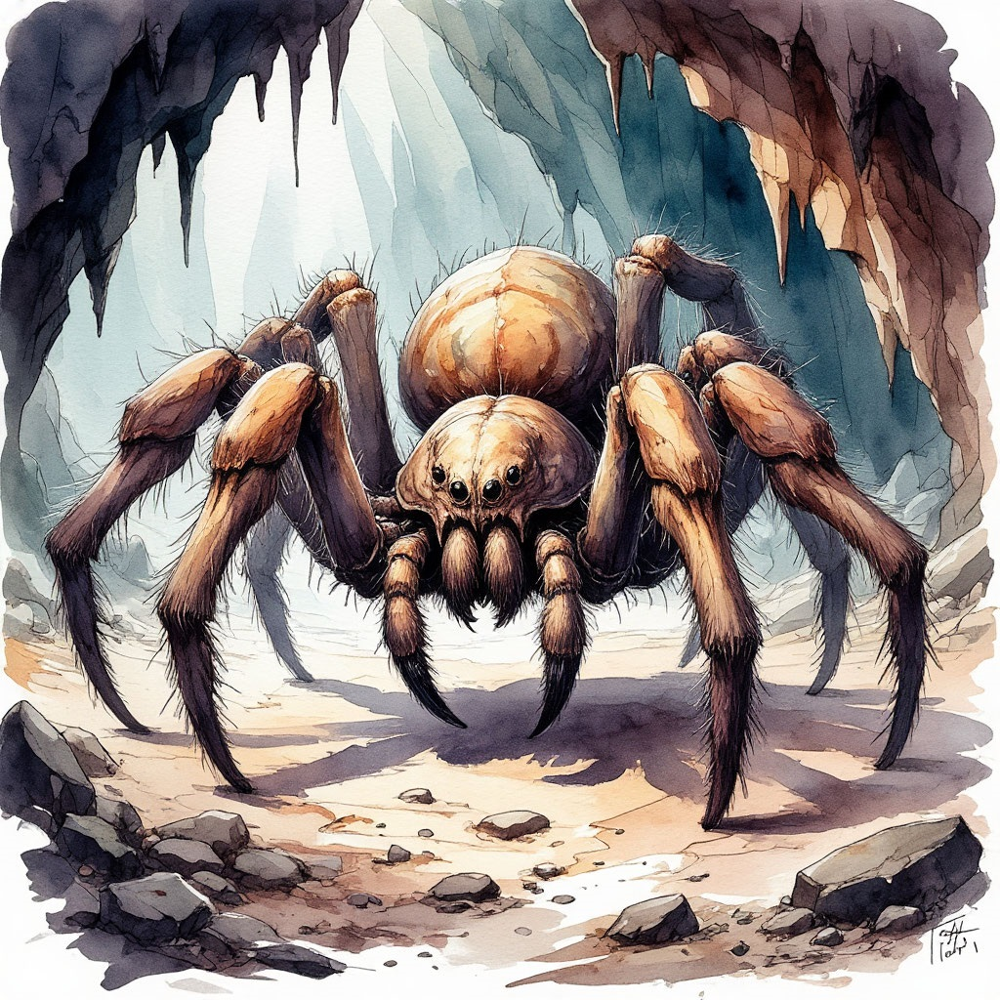

## **Об арахах.**

Гигантские паукообразные, населяющие самые глухие и дикие уголки Мэйна. 

Среди учёных нет единого мнения, являются арахи отдельной разумной расой или же просто высокоорганизованным видом полу-разумных существ.

Летописи Перворождённых не содержат свидетельств о подобных созданиях. Первые упоминания о гигантских разумных пауках относят к периоду Неизвестных Эпох, из чего напрашивается вывод, что арахи – порождения Эпохи Хаоса.

Есть множество фактов, свидетельствующих как в пользу этой теории, так и против неё. Арахи действительно нередко становятся жертвой Искажения, обращаясь в преданных и смертоносных слуг Владык Преисподних. Их души уязвимы перед извращённой силой хаотического эфира, и эта податливость часто трактуется как зло, заложенное в природе паукообразных.

Но Демоны – не единственные господа арахов. Их также нередко замечают на службе у Зодчих – божественных хранителей природных основ. В летописях Мастеров Металла встречаются легенды о том, что именно раса Древних создала арахов и наделила их разумом, чтобы те помогли залечить раны, нанесённые миру Эпохой Хаоса.

Велды были убеждены в правдивости этой легенды, поэтому многие живые механизмы, созданные Иррадинской Империей, имеют облик, сходный с образом этих существ. По иронии, Зодчие, как и обожествляющие их Мастера Металла, оказались куда лучшими хранителями, нежели творцами. Подобно тому, как механизмы велдов обратились против них, так и искажённые арахи часто становятся врагами Древних.

Существует три видовых царства арахов: аурбы, вирхас и шессаты.

### **Аурбы**
Наиболее редкий и самый чудовищный вид арахов. Это гигантские существа, обитающие в крупных, но не глубоких пещерах. Обликом аурбы сходны с различными видами обычных пауков, но превосходят их размерами в сотни раз. Размах лап крупнейших из известных особей аурбов мог достигать более тридцати метров.

Аурбы – агрессивные хищники, одиночки и каннибалы. Они обоеполы, и, размножаясь, пожирают и партнёра, и большую часть своего потомства. Охотятся аурбы на любых крупных существ, разумных и неразумных, опустошая целые регионы в ареале своего обитания.

Это чудовищная форма жизни, охотой на которую занимаются представители почти всех разумных рас континента. Однако, несмотря на их старания, популяция аурбов остаётся стабильной. Новые особи постоянно возникают в необжитых регионах, и никто не может выяснить причину подобной жизнестойкости.

Аурбы считаются полу-разумными существами, не обладающими интеллектом высшего порядка, но всё же превосходящими умом обычных зверей.

### **Вирхас**
Ещё одна редкая разновидность арахов. Это странные существа, имеющие два торса – верхний, вертикальный гуманоидный, и нижний, горизонтальный паукообразный или насекомоподобный.

Вирхас достигают средних размеров, сопоставимых по габаритам с представителями расы кенари, и считаются условно разумными существами. Миру известны поселения и даже государства, построенные этими арахами. Однако их наиболее высокоразвитые сообщества неизменно возникали под контролем Зодчих.

В чём-то вирхас похожи на ящеров аксар. Они возвышаются над прочими арахами, часто выступая для них пастырями и связующим звеном с остальным миром. Многие из них являются сильными Одарёнными, что делает их ценными союзниками и чрезвычайно опасными врагами.

### **Шессаты**
Наиболее распространённый и известный вид арахов. Это полу-разумные – или, реже, разумные – паукообразные, живущие многочисленными общинами в густых лесах, горной местности, на болотах и в глубоких пещерах. 

Шессаты известны тем, что их сообщества обладают подобием «разума роя». Каждая из особей связана с другими особым чутьём, позволяющим действовать им как единому организму. Эта особенность является одновременно и сильной, и слабой стороной шессатов.

Их невозможно застать врасплох, невозможно обмануть или запугать. Они являются чудовищной угрозой на поле боя и поднимаются на самую вершину пищевой цепи своего ареала обитания. Однако, вместе с тем, разум и дух роя шессатов чрезвычайно уязвимы.

Они подвержены влиянию Искажённых сил, и этим часто пользуются их адепты. Осквернённый Дар, отравляя одну особь роя, словно чума распространяется среди всех остальных, поражая безумием и мутациями целые сообщества арахов.

## **Отношение к арахам**

На большей части континента ко всем трём видам арахов относятся как к монстроподобным хищникам. Их стараются истреблять и удерживать как можно дальше от границ цивилизованных сообществ. Что лишь усиливает враждебность арахов по отношению к остальному миру.

Лишь в исключительных случаях, отдельным особям или небольшим сообществам арахов удаётся стать частью мультикультурного социума. Так, например, Таллард уже многие века привлекает на княжескую службу шессатов, используя их в качестве высокочувствительных ищеек и палачей. А в джунглях Локсгара есть целые племена кахага, живущие в симбиозе с роями арахов.

И всё же, несмотря на эти исключения, любому путнику стоит опасаться встреч с этими существами. Это жестокие и безжалостные хищники, обладающие прочным хитиновым панцирем, мощными челюстями, цепкими лапами и смертоносным ядом. Разрастающиеся цивилизации постоянно теснят их охотничьи ареалы, изгоняют с обжитых мест и повсеместно истребляют. Что, в конце концов, превращает большинство арахов в вечно голодных и озлобленных гигантских пауков.
