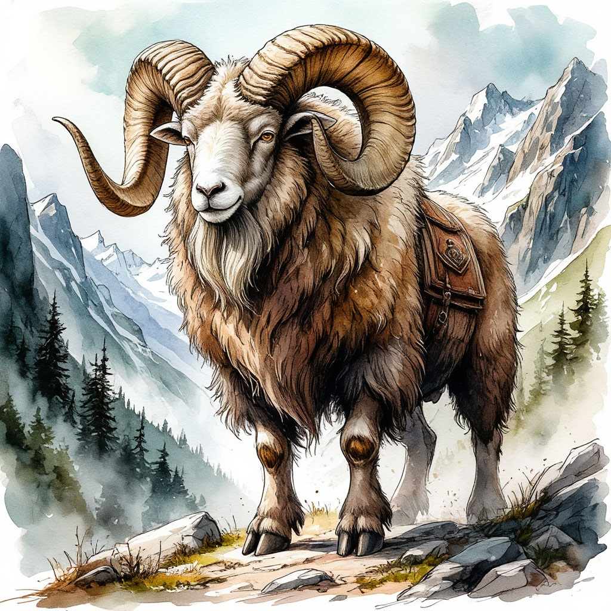

Огромные горные бараны, обитающие на всей территории Талосских гор. Рост взрослых особей в холке достигает почти двух метров, при массе более шестисот килограмм.

Бадри крупнее, массивнее и выносливее лошадей, и являются основным видом верховых животных в пределах Хребта Мира. Они плодовиты, неприхотливы в еде и условиях содержания, легко поддаются дрессировке, а также ценятся за густую шерсть и питательное молоко.

Ирун Джадамара считают бадри ценнейшим сокровищем своей страны. Золотая корона местных царей с самых древних времён изготавливается в виде бараньих рогов, а на царском гербе изображена баранья голова.

Бадри являются персонажами многих легенд, сказок и мифов, они часто предстают в связанных с ними культурах в образе народных спасителей, покровителей героев и божественных посланников. Согласно мифу о появлении бадри, они были созданы рогатым Богом Ауром, вместе со стадами туров, аурохов и племенами тавров.
