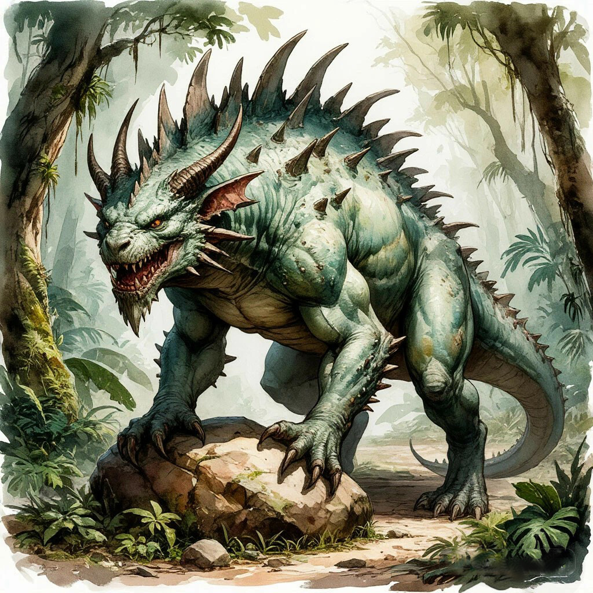

Чудовищные хищники, встречающиеся по всему континенту и неизменно занимающие вершину любой пищевой цепи. Эти теплокровные рептилии достигают огромных размеров: ростом до четырёх метров,  весом более двух тонн и размахом передних конечностей до пяти метров.

Балхорны обладают прочной шкурой, усеянной костяными защитными шипами, мощными челюстями, на которых расположены разные типы зубов, острыми когтями на лапах, также имеющими отставленный большой палец на ладонях, и длинным, увенчанным шипом хвостом.

Кроме того, балхорны считаются полу-разумными существами, обладающими способностями к сбору, оценке и анализу информации, а также навыками примитивной социализации и речи. Всё это делает балхорнов одним из самых смертоносных сухопутных хищников Мэйна.

Их единственная уязвимость – очень низкая плодовитость. Балхорны живут долго, нередко свыше столетия, и за это время производят на свет всего одного или двух детёнышей. И это является хорошим противовесом для природного баланса в ареалах их обитания.

Это хищники-одиночки, которые почти не допускают сородичей в свои обширные охотничьи угодья. Лишь изредка, при значительной угрозе, или в брачный период, они сбиваются в небольшие стаи из трёх-четырёх особей, представляя в это время особо серьёзную опасность для окружающих земель.

При этом балхорны никогда не считались серьёзным врагом цивилизованных существ. Они стараются держаться подальше от поселений, редко атакуют большие караваны или массовые скопления. Их жертвой чаще всего становятся одинокие путники или селения на отшибе, потому как сами балхорны предпочитают жить на диких и необжитых территориях.

Из-за естественно низкой популяции этих существ, охота на них запрещена в ряде государств континента – таких как Эйнлад, Эреда, Лаброс, Бэнд, а также на территории Сарабанта и Идзарийского архипелага. Но и там, где такого запрета нет, балхорнам удаётся избегать полного истребления, несмотря на все усилия охотников.

Для добытчиков балхорны представляют собой живую сокровищницу. Их ценят за прочную кожу, из которой делают лёгкие доспехи, специальную одежду, ремни, стропы, компоненты орудий и механизмов; за гибкие и прочные кости, служащие основной для некоторых видов оружия и инструментов; рога, обладающие особой ценностью для коллекционеров. 

Кроме того, кровь взрослых балхорнов усиливает свойства некоторых алхимических составов, а различные органы способны придать им особые эффекты. Причиной этому является способность этих хищников накапливать в своих телах первородный эфир, вблизи источников которого они предпочитают строить свои логова.

Создание бахорнов в различных мифах приписывают разным Богам. Кто-то считает их порождениями жестокого Зверя, кто-то – рогатого Аура. Однако ни на полуострове Зверя, ни в степях Аура эти создания не встречаются. Другие легенды приписывают творение балхорнов рукам Зодчих или даже самих Драконов.

Есть также мнение, что эти рогатые хищники являются порождениями Скверны, Искажёнными чудовищами, результатом демонических экспериментов. Однако никакими чертами и особенностями – за исключением свирепости и смертоносности – присущими искажённым мутантам, балхорны не обладают.

Изображением балхорна часто украшают свои знамёна различные воинские сообщества: отряды и гильдии наёмников, рыцарские ордена или объединения охотников. Оно является символом свирепости, бесстрашия и опасности.

