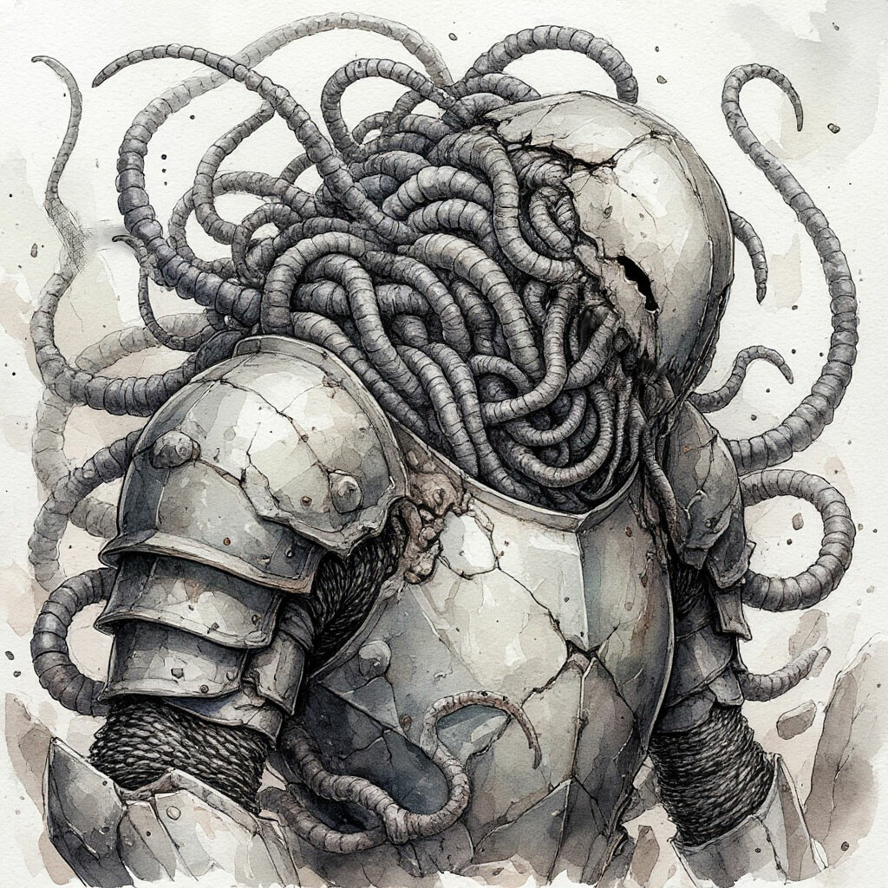

Игилии, или игилийцы, это особый вид подземных червей, обладающих коллективным разумом. Отдельные особи не отличаются крупными размерами или интеллектом, заметно превосходящим обычных животных.

Однако, объединяясь в рои и колонии, игилии кратно умножают свои когнитивные способности. Так объединение из нескольких сотен особей сравнимо по уровню самосознания с отдельным человеком. Многотысячные же популяции формируют устойчивые цивилизационные социумы.

Они не используют для общения речь или звуки. Первичная коммуникация отдельных особей происходит при помощи вибраций их тел. Затем, когда количество червей в формирующемся рое достигает высокого числа, между ними формируется устойчивая духовная связь, разрушить которую может лишь гибель всей колонии.

Кроме того, коллективный разум игилиев может заметно влиять на рост и форму отдельных особей, приспосабливая их для выполнения определённых задач. Это умение особенно полезно в тех случаях, когда эти червеподобные создания сталкиваются с представителями других рас.
Будучи по своей природе довольно спокойными существами, игилии стараются создавать условия для мирного контакта с другими видами. Плотные сплетения червей копируют физическую форму тех, с кем им предстоит вести диалог. Воссоздают они и детали их внешнего облика, изготавливая похожую одежду и броню – на случай возможной агрессии.

Стоит отметить, что сходство выходит довольно условным – способностями к полной мимикрии игилии не обладают. Несмотря на все свои старания, они продолжают оставаться извивающимся клубком огромных червей, облачённых в одеяния и броню. В сочетании с потусторонним вибрирующим звуком, которым они имитируют вербальную речь, это создаёт весьма угрожающий образ.

Укрепляет его и то, что на агрессию черви способны отвечать незамедлительно и масштабно. Их интеллект не включает в себя привычные виды эмоций и эмпатии. Их понятия о морали и законе во многом зависят от того, с какой средой они сталкиваются при первом контакте с другими цивилизациями.

Поэтому известны случаи, когда эти контакты всё же перерастали в конфликты, в которых игилии неизменно представали ужасающими и чудовищными противниками. Несмотря на уязвимость и даже беспомощность отдельных червей, их колонии обладают невероятной стойкостью и способностями к быстрой адаптации.

Впрочем, сами по себе встречи с игилиями являются редкостью. Будучи порождениями подземного мира, они очень неохотно покидают его пределы. Самый известный – и единственный – пример формирования устойчивой связи червей и поверхности – Игилийский Доминион, являющийся частью Игилийской Империи.

Доминион – это государство, занимающее обширную местность вокруг огромного озера Генъяраб. Оно возникло, когда черви из подземной Империи пострадали от очередного конфликта Бессмертных и людей, взывающих к разрушительным силам за право владеть куском этой земли.

Игилии прогнали весталийцев и Бессмертных, позволив остаться на берегах Генъяраба лишь оркам ивери, [изгнанным со своей родины](/locations/jadhamar/). Чёрные талги выступили наместниками воли своих новых подземных владык и сформировали с ними прочный союз, существующий и многие века спустя.

Именно игилийцев представляет себе большинство жителей Мэйна, когда речь заходит об этих загадочных червеподобных существах. Ни одно другое их государство не вышло за пределы необъятных подземных просторов, и потому о них мало кто знает.

Собственный миф игилиев о творении гласит, что их породил бескрылый подземный дракон Агайл, сын дракона тьмы Кора и родич дракона камня и огня Аркаада. Согласно той же легенде, игилии и [вурмы](/creatures/wurms/) – гигантские подземные змеечерви – принадлежат одному божественному племени.

Подтверждений или опровержений этому мифу не существует. Однако известно, что, в отличие от вурмов, игилии не нуждаются в близости источников первородного эфира. Следы длительного присутствия колоний червей найдены даже в самых глухих уголках подземного мира, лишённых малейших следов Дыхания Драконов.

При этом игилии обладают заметной властью над вурмами, и способны оказывать значительное влияние на их поведение. Так, когда игилийцы были призваны своими орочьими союзниками для освобождения Джадамара, черви, помимо отдельных ветвей колонии, втянули с собой в войну заметное число вурмов исполинского размера.

Становились ли змеечерви частью коллективного разума, подчинялись приказам игилиев, или же следовали инстинктивным сигналам – сказать сложно. Игилии яростно сопротивляются любым попыткам исследовать их, и по-прежнему остаются загадкой для учёных всего мира.
