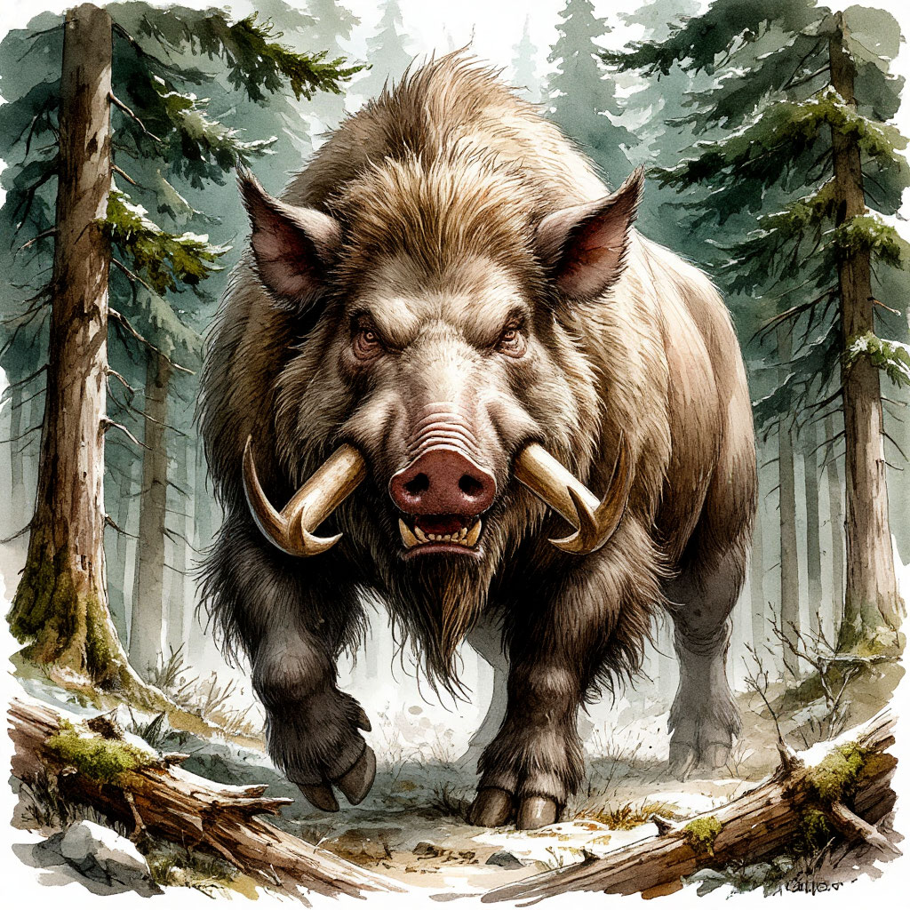

Всеядные вепри огромных размеров, обитающие в дремучих лесах Северного Пояса, Весталии и Эреды.

От обычных кабанов шорбалы, помимо значительных размеров, отличаются наличием выраженных острых клыков и двух пар массивных бивней у самцов.

Эти лесные чудовища нередко перерастают в холке взрослую лошадь, отличаются буйным нравом и бесстрашием. Шорбалы по праву считаются одними из самых опасных лесных существ. Их численность велика, они не сторонятся людей и даже способны нападать на небольшие поселения. В поисках пропитания эти вепри могут уходить на огромные расстояния от своих логовищ, и всюду, где они появляются, популяции других животных страдают от их клыков и грядущего опустошения.

Шорбалы считаются неразумными зверьми, имеющими, однако, божественное происхождение. Согласно волчьей легенде, вепри-исполины были созданы Зверем, как и многие другие лесные чудовища. Однако легенда, как это часто бывает в подобных случаях, не отвечает на вопрос – зачем он это сделал. В ней лишь говорится, что с появлением шорбалов "жестокость жизни в диких лесах умножилась неимоверно".

И действительно, среди многих опасностей, подстерегающих путников в густых древних чащобах, встреча с шорбалом – одна из самых вероятных и неприятных. Тем не менее, за сохранностью популяции ужасных вепрей стараются следить везде, где они обитают. Их ценят за прочную шкуру, теплый мех, хорошее мясо и дорогие бивни. Кроме того, они являются силой, сдерживающей распространение других опасных видов крупных хищников, являясь для них очень непростой и угрожающей добычей.

Несмотря на их буйный нрав, шорбалов порой удаётся приручать некоторым племенам эйнов, талгов и людей. Эти создания не способны стать покорной домашней скотиной, но их интеллекта хватает, чтобы принять сложную межвидовую иерархию. В результате таких союзов из шорбалов получаются грозные боевые звери.

Культуры народов, живущих бок о бок с этими чудовищами, пропитаны и уважением, и враждебностью к ним. В фольклоре шорбалы неизменно предстают как разрушительная и зловещая сила, приносящая беды и хаос. Однако в геральдике фигура шорбала занимает почетное место, украшая знамёна многих знатных домов.

