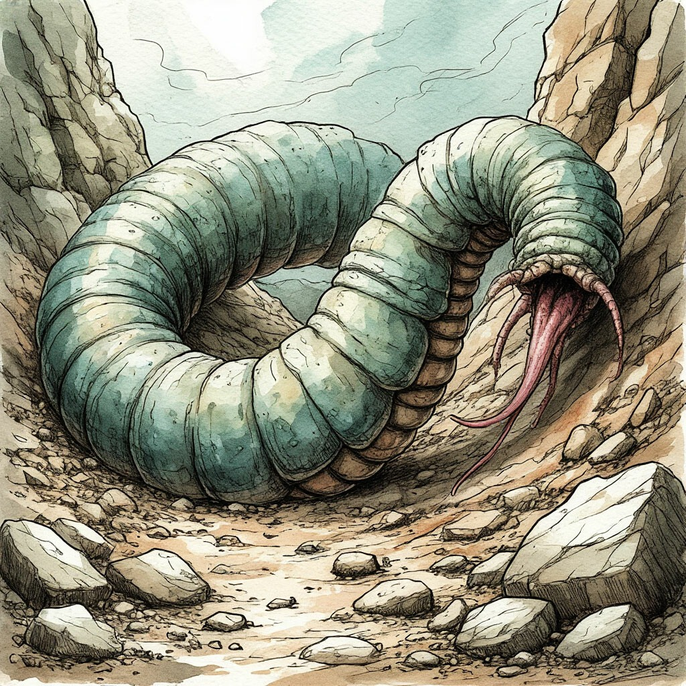

Исполинские змеечерви, обитающие в толще земли. Вурмы в большей степени являются порождениями первородного эфира, чем созданиями из плоти и крови. Устраивая гнёзда в местах слияния Планов Тэйна и Геона, они поддерживают грани между ними, и исходящие из них природные явления.

Считается, что вурмы продолжают расти на протяжении всей жизни, достигая исполинских размеров. Наиболее крупные особи никогда не поднимаются к поверхности, неспособные отдалиться от источников эфира, поддерживающих их существование.

Рождаются вурмы из твёрдых коконов, длиной до метра и четверти в диаметре. Они предстают миру тяжёлыми и неуклюжими существами, больше похожими на личинок насекомых. С самого первого мига они предоставлены самим себе – взрослые особи сбрасывают коконы у поверхности и уходят вглубь, не проявляя ни тени заботы о потомстве.

Новорождённые вурмы стремятся попасть в мягкие плодородные почвы, где медленно передвигаются в толще земли, питаясь, преимущественно, продуктами жизнедеятельности растений. Этот процесс может затягиваться на годы, и всё это время молодой вурм чрезвычайно уязвим к любым внешним угрозам.

Питание молодой особи может серьёзно истощить почву, приводя к гибели лугов, полей и лесов. Из-за этого крестьянские хозяйства считают их вредителями, и безжалостно истребляют всюду, где могут найти. Новорождённый вурм может стать добычей и некоторых хищников, восприимчивых к подземным вибрациям – таких как балхорны, арахи или гигантские волки.

Лишь преодолев порог роста в три и более метра, вурм обзаводится более прочной шкурой и расширяет свой рацион, потребляя не только питательные вещества из почвы, но и твёрдую пищу с поверхности. В основном она сохраняет своё растительное происхождение, но могут стать добычей змеечервей и неосторожные животные.

С этого момента, и до следующего порога, когда вурмы начинают обрастать каменным панцирем и опускаться глубже, они считаются взрослой особью, и являются особо ценной добычей для охотников. Шкура взрослого вурма является самым прочным портняжным материалом, устойчивым к разрывам, проколам и разрезам, но при этом сохраняющим мягкость и относительно небольшой вес. Кроме того он почти не горит и не подвержен действию любых известных кислот.

Такие свойства делают этот материал незаменимым при изготовлении лёгких доспехов и одежды специального назначения. К счастью, несмотря на огромный спрос на него, вурмы сохраняют стабильно высокую популяцию.

Охота на них является рискованным занятием. Озлобленный взрослый вурм способен развивать внушительную скорость под землёй, выныривая на поверхность в самых неожиданных местах. Связь с Тэйном позволяет им легко прорезать землю и камень любой плотности. И, поскольку вурмы подвержены влиянию Искажения, это может сделать их ужасающими чудовищами, способными вызывать настоящие природные катаклизмы.

О разуме вурмов ничего доподлинно не известно. Большинство учёных считает их примитивной формой жизни, ведомой лишь самыми базовыми инстинктами. Однако в природе существует разумный вид существ, родственных вурмам – игилии.

Известны случаи, когда вурмы и игилии действовали сообща, объединяясь против общей угрозы. Неизвестно, является ли это доказательством способностей змеечервей к коммуникации, или же это следствие особого дара игилийцев к воздействию на разум подземных существ. Поэтому, как и в случае с другими видами эфирных существ, нельзя с уверенностью утверждать, что гигантские вурмы не обладают какой-либо формой сознания.

Существует две легенды о божественном происхождении змеечервей. Одна гласит, что этих существ, как и арахов, создали Зодчие, для помощи в поддержании природных процессов. Согласно другой, распространённой в культуре игилийцев, у вурмов и игилиев был один божественный предок – Агайл, бескрылый подземный дракон. В мифологии разумных червей Агайл является сыном Кора, Дракона Тьмы, которого Великий Бог поместил под землю, чтобы сохранить связь со своим братом – Драконом камня и огня Аркаадом.

Интересно, что, хотя вурмы и игилии точно существовали в Эпоху Перворождённых, упоминания о культе Агайла встречаются лишь в поздний период Неизвестных Эпох. Однако при этом он не является уникальным мифом народа червей. Следы поклонения Агайлу встречаются в культурах ману и популяций подземных разумных арахов.

Многие культуры считают вурмов мостом, связывающим поверхность с таинственными подземными глубинами. Эти странные, огромные и жуткие создания напоминают жителям Мэйна о том, как на самом деле велик мир вокруг них, и под их ногами.
