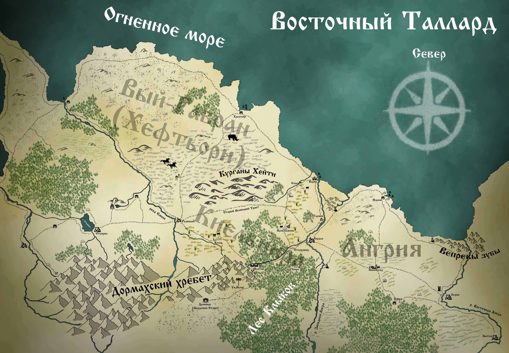

Киельнира – область Таллардского Княжества, зажатая между реками Емшой и Западной Ангрой. С юга Киельниру подпирает Дормахский хребет, а от северных морских ветров она укрыта высокими холмами Курганов Хейти. 

Это благодатный край с мягким климатом, хорошо подходящим для сельского хозяйства. В полях, раскинувшихся между Курганами Хейти и лесом Фанглунд, находится немало крестьянских поселений, окруженных многочисленными фермами и обширными пахотами. 

Некогда центром этой области был великаний город Скаепторн, к которому, пересекая весь регион, вёл широкий каменный тракт. Однако, когда великаны ушли, этот путь оказался заброшен. Скаепторн превратился в некрополь, и следы присутствия его прежних хозяев постепенно растворились во времени.

Вокруг Курганов Хейти с самого момента их появления витало множество зловещих слухов, лишь укрепившихся за прошедшие века. Немногие торговцы решаются провести свой караван под зловещей тенью холмов, хоть этот путь и короче других. Слухи о разбойниках, призраках и чудовищах, спускающихся по ночам со склонов, вкупе с загадочными исчезновениями целых обозов, отпугивают всех, кроме самых отчаянных смельчаков.

С запада воротами в Киельниру является крупный торговый город Развилка, расположенный на восточном берегу реки Емша. От Развилки, что следует из названия, дорога расходится на три стороны. Заброшенный великаний тракт – самый короткий путь на восток. Северная дорога проходит по области Вый-Гавран, иначе именуемой Хефтьёрном, и ведёт в портовый город Хролгейр, а из него в Варну.

Южная дорога вьётся полями Косны и уходит в лес, к древнему укреплённому городу Млатову. Млатов был одной из первых Таллардских крепостей, основанных в Киельнире. Первый острог на этом месте был заложен ещё сыном Князя Яробара, Настаном. 

Ныне Млатов известен своими мастеровыми, развитой добычей редких руд в Дормахах, сильной дружиной и суровыми законами. Это один из двух самых влиятельных городов области, с которым соперничает лишь приморская Варна. Местные жители зовут себя млаты.

Лес, в котором расположен Млатов, зовётся Фанглундом, или лесом Клыков. Несмотря на все усилия Млатовских егерей и дружинников, в лесу до сих пор в изобилии водятся опасные хищники и свирепые чудовища. Зверопоклонники верят, что в Фанглунде находятся одни из врат в Великую Чащу, дом Зверя. И потому, насколько бы ни был опасен и суров этот лес, настоящее зло никогда не сможет укрепиться в его пределах.

На южной границе Киельниры, среди заснеженных Дормахских пиков расположен гномий форпост Ун-Булаг, откуда стеннары иногда посылают в Млатов торговые караваны. Ун-Булаг является частью Руд-Гарадского гномьего государства, чьё влияние распространяется на весь Таллард и часть северного Ирланда, соприкасаясь с владениями Ирландского Ун-Шарта.

Многочисленные территориальные споры двух могущественных гномьих государств не раз втягивали Ирланд и Таллард в междоусобные конфликты, в ходе которых Ун-Булаг многократно оказывался покинут и запечатан. Однако рано или поздно гномы всегда возвращались обратно.

От Млатова дорога через лес Клыков выводит к большому поселению Стерховицу. Местные жители, что зовутся стерхи, живут за счёт прилегающего к ним леса и многочисленных караванов, идущими через них с запада в ангрийскую Бордлу. Стерховиц относится к Млатовской вотчине, и является её егерским центром.

Бордла – крупный ангрийский город, восточные ворота Киельниры. Бордлская переправа была заложена первым Таллардским Князем – Яробаром, и с тех пор не потеряла своего значения. От Бордлы по западному берегу уходит и основной тракт, ведущий посуху от Млатова в Варну. И хотя Бордлу с Млатовым связывают тесные торговые связи, отношения между этими двумя городами всегда были натянутыми.

В начале Эпохи Раздора, ангрийская знать, недовольная растущими аппетитами Медвежьего Залива, подняла восстание. Воспользовавшись тем, что основная часть Княжеских войск отправилась на войну с Ирландом, чватичи вторглись в тогда ещё полудикую Киельниру, отбросив немногочисленные гарнизоны за Емшу. 

Непокорёнными остались лишь млаты, тогда ещё немногочисленные воители одинокой горной крепости. Оказавшись в плену многолетней осады, гарнизон не пожелал сдаваться, и делал всё, чтобы не дать захватчикам одержать окончательную победу. Именно благодаря их стойкости и яростному упорству, ангрийцам так и не удалось закрепиться в Киельнире. 

И когда Княжеские войска вернулись на север, уязвленные поражением в войне с Ирланлом, им удалось выгнать восставших обратно за Ангру. Однако обе стороны были обескровлены чередой конфликтов, и не могли поставить точку в этом противостоянии. 

При поддержке восточных соседей, ангрийцы объявили о своей независимости, и долгое время Князь не мог её оспорить. Оплотами этого противостояния стали Млатов и Бордла, совершающие поочерёдные налёты друг на друга. 

До самой Эпохи Королей Киельнира пребывала в шатком положении спорной территории, пока, наконец, объединение Княжеств в единое Королевство не положило конец этой вражде. Ангрия вернулась в состав Талларда, и после этого Киельнира начала обретать те черты, которые имеет в наши дни.

Ещё одна дорога из Млатова на север ведёт от Стерховица через поля. Там, недалеко от древней дороги великанов, расположено поселение, имеющее сейчас название Яров Камень. Однако совсем недавно оно звалось Тилица, и при жизни прежнего боярина Млатова едва не было сожжено налётчиками-нордарами. 

Обойдя Варну, северяне прошли вглубь страны, и начали грабить Млатовскую вотчину. В Тилице грабителей настигла боярская дружина, однако нордары взяли селян в заложники, и грозились вырезать всех, если их не отпустят. 

Тогда боярин Млатова - Яровил - для гаранта безопасности налётчиков предложил себя в заложники, в обмен на свободу жителей. Северяне согласились, однако прежде Яровил передал своему сыну Ратобору свой меч, боярский перстень и приказ - атаковать северян, едва те выйдут за пределы Тилицы. 

И было воспитание Ратобора таково, что он, хоть и сквозь слёзы, но исполнил отцовскую волю. Нордары умертвили старого боярина, но и сами полегли до последнего. Тилицу же благодарные и скорбящие селяне переименовали в Яров Камень, в честь самопожертвования их правителя, а себя с тех пор называют ярами. За то происшествие млаты, яры и стерхи крепко недолюбливают жителей Варнской вотчины, за то, что те пустили нордаров на юг, не помешав им, и не предупредив соседей.

И в целом между Варной и Млатовым существует давнее соперничество. Закостеневшие за высокими стенами старых традиций и кровных обид, суровые млаты являются помехой для стремительного прогресса торговой столицы. Авторитет каменной твердыни сдерживает развитие деловых отношений варнийцев за пределами Королевства, ибо потомки первых бояр помнят, как часто их предки оказывались окруженными со всех сторон, без друзей и союзников. 

От Ярова Камня дорога сходится с великаньим трактом, и отходит от Курганов чуть восточнее, огибая небольшую рощу, у которой расположилось поселение Бос. Живущие здесь босы - странный народ, чтящий мёртвых героев, похороненных в Курганах. Однако нрав их незлоблив, и редкий караван, идущий по великаньей дороге, всегда может найти приют в Босе.

Между Босом и Варной расположено поселение Оскол, в котором воздвигнут каменный острог для защиты внутренних областей. Его-то гарнизон и мог бы остановить последний кровавый налёт нордаров на соседнюю вотчину. Но оскольчане за собой не чувствуют вины, замечая, что северяне обошли их через Курганы, в которых никто и никогда не ставил дозоров.

Кроме Оскола, на берегу Ангры между Бордлой и Варной стоит ещё одно поселение – Торжок. Это крупная стоянка для караванов и лодок, где купцы могут привести в порядок груз, отдохнуть и совершить друг с другом некрупные сделки. В Торжке же останавливаются те, чей путь лежит мимо рынков Бордлы и Варны, и кто не желает платить лишних пошлин за стоянку.

Варна – первый по величине город Киельниры. Это относительно молодой, но быстро развивающийся портовый город, построенный на месте разрушенного великаньего города Тарга. Варна - основной торговый соперник ангрийской столицы – Нэрима. Расположенные друг от друга всего в нескольких часах полёта на грифоне, они яростно соревнуются за право стать первым рынком восточного побережья Талларда.

В Варну стекаются все товары, что купцы планируют продать дальше на востоке. А в Нэрим стягиваются торговцы с востока, ищущие выхода в западные моря. Поскольку крутые скалистые берега Вепревых Клыков в устье Восточной Ангры не позволяют основать там более выгодной гавани, Нэрим остаётся главным ангрийским портом. К тому же, Ангрия обладает рядом торговых свобод, делающих её более выгодной для купцов из Тинерийской Империи и Альянса, нежели Варна, в которой действуют многочисленные ограничения и пошлины.

Киельнира – словно бурлящий жизнью котёл восточного Талларда. Несмотря на ощутимый налёт провинциальности, регион является важным торговым узлом, в котором сходятся интересы не только пограничных областей, но и других стран. 
На здешних дорогах всегда можно встретить вереницы путешественников, полноводные реки несут по себе многочисленные торговые суда, а города полны дельцов и предпринимателей любого пошиба, от мелких лоточников до глав купеческих гильдий.

К сожалению, такое изобилие имеет и обратную сторону. Богатства Киельниры манят и лиходеев всевозможных мастей. Бандиты, культисты и чужеземные налётчики раз за разом обрушиваются на местные земли, нередко добиваясь успехов, оставляя за собой кровавый след разбоя и грабежей.
