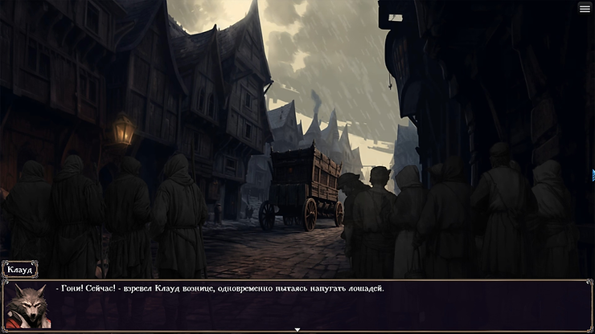

Жанр: мистика, фентези, детектив.

_Что делать, если оказаться не в том месте и не в то время — выбор, а не воля случая? Окунитесь в мрачную историю о конфликте между долгом и совестью._

_Вместе с вашим героем вам предстоит пройти тернистой тропой служителя закона, на которой вы столкнётесь с нелёгким выбором: правосудие или справедливость._

_Наведите порядок в опасной, полной тайн провинции, но не забывайте — главная схватка всегда поджидает нас внутри. Какой бы путь вы не выбрали — жестокого палача или милосердного героя, будьте твёрдыми. Сомнения — путь к безумию и смерти._

Cсылка на демо-тизер новеллы: https://drive.google.com/file/d/1IB0Y_djYMCT5ErsV3mOxbpTdD_oICE3e/view?usp=sharing Для запуска нужно распаковать архив и запустить файл Game.exe

**Скриншоты:**

