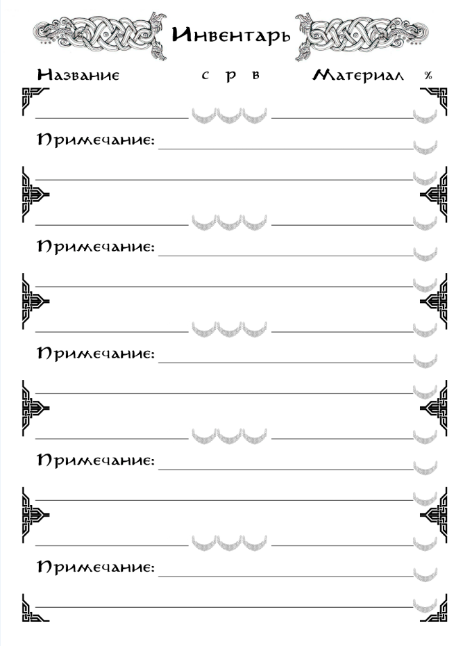

{ .img-float-right }

Любой персонаж распоряжается какими-то вещами. Даже невольник в жестокой варварской стране носит одежду, пользуется инструментами и, вероятно, скован цепями. Эти предметы могут ему не принадлежать, однако если он использует их, значит они являются частью его Снаряжения, а если носит с собой – они часть его Инвентаря.

У всех предметов есть несколько важных показателей, отражающих его свойства и пригодность для выполнения задач.

**Название** предмета определяет то, чем он является. Его тип, принадлежность какой-либо из категорий предметов. Например, «Средний доспех», «Одноручный меч», «Походный набор» и тому подобное.

**Материал**, из которого изготовлен предмет, определяет его особые свойства. Какие-то материалы делают предмет легче, какие-то прочнее, а некоторые могут понадобиться для выполнения особых задач. Например, «чёрная сталь» тяжелее обычной, но обладает повышенной прочностью; или камень «нальн» обладает свойством накапливать дневной свет, и может использоваться в качестве бездымного источника света.

**Размер** предмета определяет **Загрузку** на персонажа, а также принципиальную возможность его использования. 

**Загрузка** – это относительный процентный параметр, определяющий эффективную грузоподъёмность персонажа, зависящий от его размера (малый, средний, крупный), а также размера и типа предмета. 

Предметы, соответствующие по размеру использующему их персонажу, одинаково повышают процент загрузки при их снаряжении и переноске. При снаряжении или переноске предметов, соответствующих другим размерам существ, загрузка рассчитывается как 1/4 от самого большого к самому малому и х4 – при обратном соотношении.

Так, например, крупное существо может унести три полных загрузки малого, в то время как треть загрузки крупного станет для малого максимальным эффективным весом. 

_**Примеры Загрузки.** Одноручное оружие, изготовленное из обычных материалов без дополнительных модификаторов, занимает 8% нагрузки. Двуручное – 12% загрузки. Снаряженные боеприпасы к метательному оружию добавляют 6% (колчан стрел, сумка с болтами, набор метательных дротиков и т.д.)._

_Снаряженный доспех занимает 28%/38%/48% загрузки в зависимости от его типа (навыки владения доспехом соответствующего типа снижают этот показатель). Снаряженный щит даёт 6%-10% в зависимости от его размера.  Снаряженный кинжал добавляет 4% загрузки. Обычный «Походный набор» (кресало, огниво, трут, спальный мешок, котелок, ложка, кружка, фляга) занимает 8% загрузки, и может переноситься только в рюкзаке. Паёк на один день перехода занимает 2-5% загрузки, в зависимости от его качества, и может переноситься только в рюкзаке._

Чтобы использовать некоторые предметы, их необходимо **Снарядить** на себя (например, оружие или доспехи). Снаряженных вещей может быть ограниченное количество – столько, сколько может одновременно использовать персонаж в фазе активных действий.

Все прочие предметы находятся в **Рюкзаке**, откуда перед использованием их необходимо достать и снарядить. В зависимости от типа предмета, это может потребовать значительного времени, равное снятию рюкзака, поиску в нём необходимой вещи и её снаряжению (минимальное значение подобной задержки – один раунд активных действий). 

Также предметы можно складывать в седельные **Вьюки** животных, если таковые имеются в распоряжении персонажа. Предметы, находящиеся во Вьюках возможно использовать с той же задержкой, что и предметы из Рюкзака, если они находятся в пределах досягаемости персонажа.

**Прочность** предмета определяет пределы его использования. Предметы, изготовленные из обычных материалов без дополнительных модификаторов, теряют 2% прочности за каждое успешное использование, и 4% за каждое неудачное.

**Количество** определяет число доступных для использования предметов.
