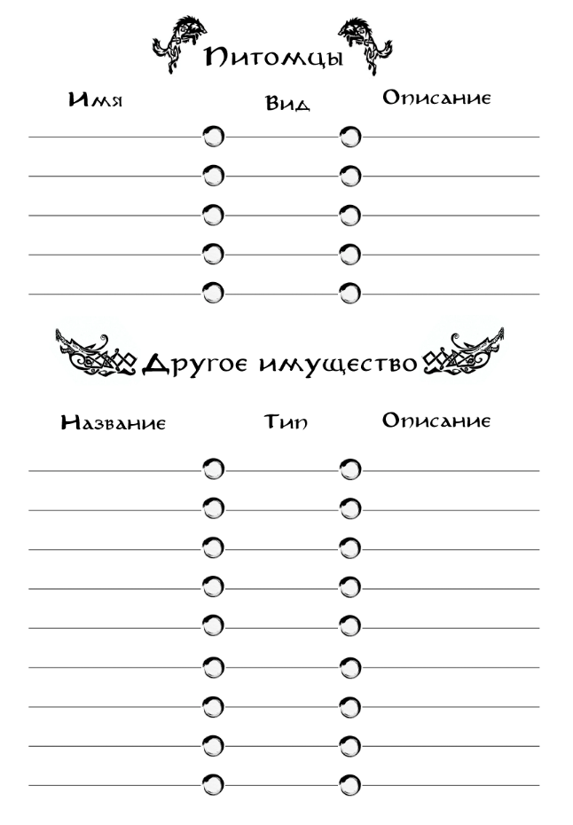

{ .img-float-right }

Помимо движимого имущества, предназначенного для непосредственного использования персонажем, у него может быть и более специфическая собственность.

К Другому Имуществу относятся земельные наделы, разнообразные сооружения, корабли, телеги и прочие средства передвижения. Владение таким имуществом не даёт персонажу преимуществ при активных действиях, однако может сыграть важную роль в истории, частью которой он является.

К Питомцам относятся верховые и служебные животные, которых использует персонаж. Все животные принадлежат к какому-то виду, определяющему их особые свойства.

Вид верховых животных определяет их размер и то, соответствует ли он размеру персонажа, который собирается их использовать. Персонажи не могут оседлать животных меньше себя. Для передвижения верхом на животных большего размера требуется навык «Езды на верховых платформах» вместо навыка «Верховой езды». 

Верховые животные имеют одинаковую базовую скорость, и в сцене с активными действиями устают вместе с персонажем (то есть штрафы Усталости одинаково действуют и на всадников, и на пеших персонажей).

Вид служебного питомца определяет область его применения. Для использования служебных питомцев необходимо владение навыком «Дрессировка». Действия, совершенные с их помощью, дают возможность совершить дополнительный бросок в соответствующей области применения.
