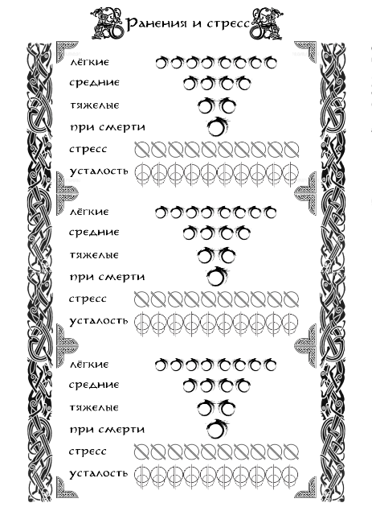

В результате любых столкновений персонажи могут получить негативные последствия в виде **Ранений, Усталости и Стресса**.

{ .img-center }

### Ранения. 
**<u>Ранения</u>** высчитываются из разницы результатов бросков, попавших в **диапазоны успеха и сопротивления** (или из прямой разницы в результатах нескольких бросков в один диапазон). **Лёгкое ранение** <u>«ЛР»</u> (ушиб, порез, рассечение и т.п.) – разница в 1 (одно ЛР) или 2 (два ЛР) успеха. **Среднее ранение** <u>«СР»</u> (отсеченный палец, сильный ушиб, лёгкий перелом и т.п.) – разница в 3 успеха. **Тяжелое ранение** <u>«ТР»</u> (перелом, травма головы, частичная или полная слепота и т.п.) – разница в 4 успеха.

Персонаж игрока может получить четыре лёгких ранения (**4 ЛР**), которые затем превращаются в среднее ранение. Два средних ранения (**2 СР**) переводятся в разряд тяжёлого ранения (**1 ТР**). Любое ранение, полученное после нанесения тяжелой раны, приводит персонажа в состояние **«При Смерти»**. В состоянии «при смерти» любое последующее ранение **добивает** персонажа.

Ранения являются накапливающимся модификатором. Лёгкие ранения **накладывают штраф** в **<u>-1</u>** к диапазону успеха. Средние – в **<u>-2</u>**. Тяжелые – в **<u>-3</u>**. В состоянии «При Смерти» персонаж, оставшийся в сознании, может совершать только простейшие действия и лишь при Полном Успехе броска. 

При получении трёх лёгких ранений (**3 ЛР**) и далее, ранения начинают накапливаться каждый раунд +1 лёгкая рана, со временем приводя к усугублению состояния персонажа. Вне боя ранения накапливаются каждый час игрового времени, если были получены только лёгкие раны, каждые полчаса – если есть среднее ранение, и каждые десять минут – если тяжёлое. 

**Лечение ранений** происходит при помощи соответствующих Навыков. «Первая помощь» позволяет исцелять только Лёгкие Ранения, не более двух (2 ЛР) за сутки игрового времени. «Медицина» позволяет исцелять Средние Ранения на уровнях «Новичок» и «Умелец» (не более одной (1 СР) за двое суток игрового времени), и понизить уровень Тяжёлого Ранения до Среднего на уровнях «Профессионал» и «Мастер» (не более одной (1 ТР) за четыре дня игрового времени).

Состояние «При Смерти» снимается при успешном применении любого исцеления, переходя в две Тяжелые Раны (2 ТР).
Ранения, имеющие более высокий уровень, чем имеет исцеляющий Навык, можно попытаться исцелить Навыком меньшего уровня, пройдя Встречную Проверку (уровень сопротивления будет на один выше, чем у Навыка).

Кроме того, Ранения могут быть исцелены с помощью специальных расходуемых предметов (у которых такой эффект есть в описании), а также магическим или божественным вмешательством.

Неудачно вылеченная или запущенная рана превращается в **Увечье**, накладывающее постоянный штраф на все действия от -1 до -3 в зависимости от тяжести. Увечье могут вылечить только хорошо обученные медики, имеющие доступ к хорошим инструментам.

Помимо ранений персонажи так же получают очки **Стресса** и **Усталости**. Эти две шкалы имеют 10 ячеек, разбитых на две части. То есть в сумме можно набрать до 20 очков обоих значений.

### Стресс. 
**<u>Стресс</u>** автоматически накапливается по 1/2 ячейки (1 очко) за раунд. Одна полная ячейка (2 очка) заполняется при получении одного лёгкого ранения. За два ранения, полученных за одну атаку, заполняется две с половиной ячейки (5 очков). За полученное среднее ранение – четыре ячейки (8 очков). Шесть ячеек (12 очков) – за тяжёлое. 

Каждое имеющееся лёгкое ранение автоматически добавляет 1/2 ячейки к росту стресса каждый круг. Каждое среднее - одну ячейку. Каждое тяжёлое – две ячейки. Накопив 5 и более ячеек стресса, персонаж получает штраф к обеим границам диапазона, становится подозрительным и агрессивным, либо наоборот, податливым и пугливым.

При достижении отметки в 9 ячеек добавляется штраф -1 к диапазону успеха. При полном заполнении шкалы персонаж получает штраф -2 к диапазону успеха, начинает паниковать, принимать нерациональные решения и теряет возможность полноценно общаться с другими персонажами. Если он при этом находится в боевой ситуации, то каждый круг проходит проверку на немедленное бегство из боя.

### Усталость. 
**<u>Усталость</u>** заполняется аналогично шкале стресса при **Загрузке** персонажа от 50% до 100%, вдвое меньше при Загрузке до 50% и вдвое сильнее при Загрузке свыше 100% (за раунд или каждый час пешего пути вне фазы активных действий). Подробнее о Загрузке персонажа в разделе «Инвентарь и снаряжение».

Свыше 5 ячеек в шкале усталости добавляют к получению стресса по 1/2 ячейки каждый круг. Все проверки физических навыков, мирных и боевых, получают штраф к верхней границе диапазона успеха. Вдвое сокращается максимально возможная скорость персонажа.

Свыше 7 ячеек в усталости добавляет по 1 ячейке к стрессу за ход. Персонаж может нести только половину веса от своей максимальной загрузки. Штраф к обеим границам диапазона успеха.

При достижении отметки в 10 ячеек усталости персонаж получает штраф -2 к диапазону успеха всех проверок, теряет возможность пользоваться доспехами и оружием. Скорость персонажа сокращается до минимально возможной, он не может перемещаться на дальние расстояния и совершать иные активные действия. Каждую активную сцену проходит проверку на потерю сознания.
П
ри полном заполнении шкалы стресса и усталости персонаж переходит в состояние «при смерти» даже если не имеет ранений.

**Шкала Стресса**, заполненная до половины, полностью восстанавливается в течение одного игрового дня. Заполненная от 5 до 7 ячеек – восстанавливается только до 2 ячеек с течением времени (3 дня) и полностью – при отдыхе в спокойном, надёжно укреплённом месте в окружении союзников (2 дня). Заполненная от 7 до 9 ячеек – восстанавливается только до 4 ячеек с течением времени (6 дней) и полностью – при отдыхе в спокойном, надёжно укреплённом месте в окружении союзников (3 дня). При заполнении шкалы полностью она восстанавливается только до 5 ячеек в течение 9 игровых дней и полностью - при отдыхе в спокойном, надёжно укреплённом месте в окружении союзников (5 дней) и обязательном посещении заведений, способствующих восстановлению психологического и духовного здоровья персонажа. Шкала стресса восстанавливается вдвое медленнее при невылеченных лёгких ранах и не восстанавливается при невылеченных средних и тяжелых ранениях.

**Шкала Усталости**, заполненная до половины, полностью восстанавливается за одну ночёвку в кровати и за две - на открытом воздухе. Это время вдвое увеличивается при заполнении шкалы выше половины. Каждое невылеченное лёгкое ранение повышает минимальный заполненный порог на одну ячейку, среднее на две ячейки, тяжелое на четыре ячейки. Персонажи, идущие маршем по пересечённой местности, с загрузкой до 100%, при вступлении в бой имеют на момент начала 3 заполненные ячейки, при перемещении по дорогам – 2 ячейки. Если персонажи путешествуют с загрузкой выше 100%, минимальные значения шкалы усталости удваиваются. При наличии любого навыка верховой езды и перемещении верхом (с вьючными животными) шкала заполняется на 1 ячейку.
