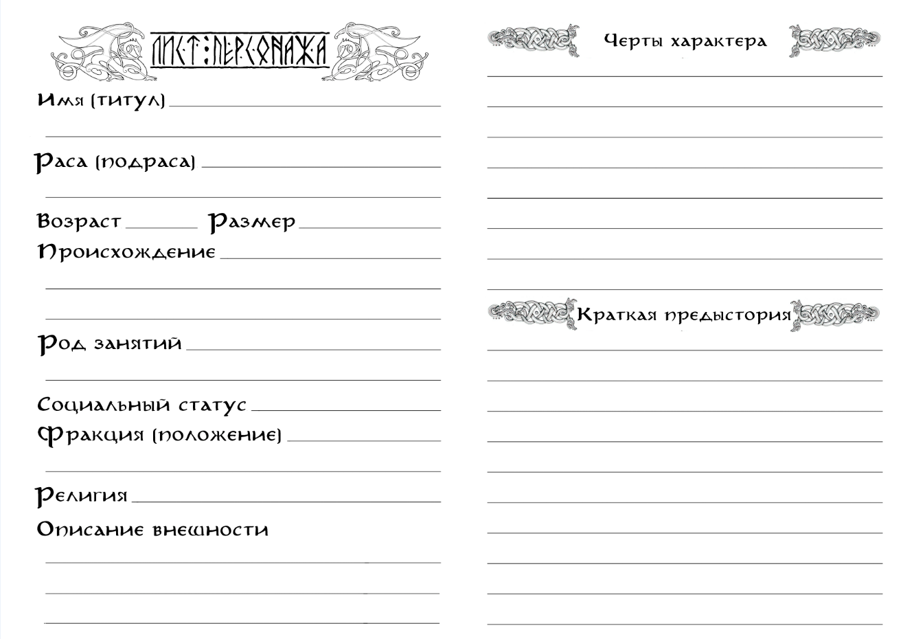

{ .img-center }

### **Имя.**
Настоящие и ложные имена, фамилии и титулы, звания и прозвища – в этом поле указывается всё, что может использовать мир в качестве обращения к персонажу. Имя это стержень, вокруг которого строится немалая часть биографии персонажа.
Оно может быть целой книгой, богатой на скрытые смыслы и глубинные связи. А может быть грубым и плоским, что само по себе скажет о персонаже не меньше, чем целое генеалогическое древо.

### **Раса (подраса).**
Мэйн населён огромным множеством разнообразных рас. Все они обладают своими уникальными особенностями, менталитетом, а также древней историей и специфическими взаимоотношениями. В первую очередь именно раса определяет то, каким будет персонаж, какое у него будет представление о мире и какие глубинные цели пребывания в нём.

Ниже приведено несколько примеров возможных игровых рас:

**<u>Стеннары.</u>** Размер: малый. Народ низкорослых, кряжистых существ, обладающих крепкими телами, стойким духом и упорным характером. Они предпочитают жить в своих подземных городах-государствах, где их общество построено на жёстких традициях, кастовых ограничениях и суровых законах. Стеннары ценят труд с религиозной фанатичностью, и известны всему миру как непревзойдённые ремесленники и несгибаемые воины.

**Особое (расовое) умение:** Стойкость стеннаров ("Камень может разбиться, но никогда не сгниёт"). Эффективно сопротивляются воздействию Осквернённого Дара (враждебной магии). Имеют иммунитет к ядам и болезням.  Могут нести загрузку существ среднего размера.
***
**<u>Ирун.</u>** Размер: средний. Высокие чернокожие существа, принадлежащие к виду талгов (орков). Этот народ известен своей степенностью и рассудительностью – ему, единственному из всего вида, удалось создать своё полноценное государство. Ирун умелые предприниматели и надёжные дельцы, обладающие гибким умом и утилитарным отношением к жизни.

**Особое (расовое) умение:** Неукротимость ирун ("Сеет мир тот, кому довелось жать войну"). Могут бороться со стрессом, сопротивляться воздействию ужаса и внушать его врагам.
***
**<u>Ульфы.</u>** Размер: средний/крупный. Народ разумных прямоходящих волков, сотворённых свирепым, хищным божеством. Ульфы обладают твёрдым разумом, создавшим одно из самых развитых государств на континенте, и диким сердцем, неизменно призывающим их из оков цивилизации в туманы родных лесов. Они известны своей несокрушимой верностью, горячей кровью и удивительными талантами в мистических практиках.

**Особое (расовое) умение:** Дух Зверя ("Нет Бога чудовищнее Зверя, и народа свирепее его потомства "). Взывают к силе своего Бога, обращаясь в свирепых и чудовищных созданий.
***
**<u>Огры.</u>** Размер: огромный. Раса человекоподобных великанов с крупной головой и конечностями, известных своей холодной жестокостью и приверженностью культу силы. Огры – народ одиночек и фаталистов, обладающих странными понятиями о морали, добре и зле. Они являются чрезвычайно умелыми и абсолютно бесстрашными воинами, а также обладают стихийным пророческим даром. Отношение всех персонажей при первой встрече – «Неприязнь» или «Вражда».

**Особое (расовое) умение:** Смирение огров ("Сильны идущие против течения судьбы, Безудержны те, кто сумел его оседлать"). Могут сопротивляться боли от ран и духовным потрясениям (стрессу). Эффективно противостоят тем, кто равен им по силе, и ещё эффективнее - тем, кто их превосходит. Иногда могут видеть будущее.
***
**<u>Кирма.</u>** Размер: средний. Невысокого роста эйны (эльфы), с раскосыми узкими глазами и сероватым оттенком кожи. Гордые жители степей, известные по всему миру за непревзойдённое мастерство в обращении с верховыми зверьми любого вида. Кирма обладают лёгким, но непостоянным нравом и легко находят как друзей, так и врагов.

**Особое (расовое) умение:** Всадники кирма ("Между землёй и небом – лишь ветер"). Мастерски управляются с верховыми животными как в мирное время, так и на войне. Умеют влиять на резвость верховых зверей и приручать их.
***
Подробнее о расовых особых умениях в разделе [«Баланс»](/main-world-wiki/strangesystem/7_system_balance/).

### **Возраст.**
Все расы живут разное количество лет. Каким-то отмерян совсем малый срок, а каким-то не определён вовсе. Однако к какому-бы народу не принадлежал персонаж, есть вещи, обучение которым занимает долгое время, или такие, которые могут быть в силу возраста просто недоступны.

Так, например, подросток не сможет освоить на достойном уровне более одного умения, а немощный старик не будет силён в битве. Поэтому персонажи, достигшие пика своих физических возможностей, будут находиться в самой середине своего жизненного пути. Те же, кто достиг глубоких знаний в ремёслах или науках, разменяют более почтенное количество лет. А тем, кто ни в чём пока не достиг высот,  едва ли довелось выйти из поры буйной молодости.

Возраст персонажа, имеющего на старте своего пути два и более навыка уровня «Профессионал», должен быть близок к средним значениям для своей расы. Персонаж, имеющий хотя бы один навык «Мастера», будет иметь возраст, превышающий среднее значение для своей расы.

### **Размер.**
Всех существ игрового мира можно разделить на 6 типоразмеров: крохотный, малый, средний, крупный, огромный, исполинский. Игроки могут создать персонажей любых размеров, кроме «крохотного» и «исполинского».

К **малым** существам, например, относятся такие расы как: стеннары (гномы), йохары (гоблины), холинги (полурослики) и келгары (карлики). Существа малого размера передвигаются вдвое медленнее, чем существа среднего размера и могут нести вдвое меньший вес, чем они.

К **среднему** размеру относится большая часть всех существ Мэйна, например расы людей, эйнов (эльфов), талгов (орков) и ульфов. Передвижение и переносимый вес средних существ принимаются за базовые значения, и именно от них высчитываются корректировки для других типоразмеров. Максимально возможная скорость (без модификаторов) существ среднего размера – 6 условных единиц (метров/футов) за минимальный отрезок времени (2 секунды).

К **крупным** существам, например, относятся такие расы как: тауры, кенари, огры и урсы. Существа крупного размера передвигаются с вдвое больше эффективностью, чем существа среднего размера, и могут нести вдвое больший вес, чем они.

К существам **огромного** размера относится, например, большинство видов великанов: турсы, алоги, тролли, циклопы и другие. Огромные существа перемещаются втрое быстрее, чем существа среднего размера, и могут нести вчетверо больший вес.

### **Род занятий.**
Что-то, чему персонаж долгое время обучался, и в чём достиг наибольших успехов, что предпочитает называть своей стезёй или профессией – это его **Род Занятий**. Он определяет, какие Навыки мог освоить персонаж (делает некоторые Навыки **обязательными** при генерации, но снижает их стоимость и ускоряет развитие), какими Талантами он может обладать, и какие Изъяны мог заработать.

Род занятий делится на общий **Тип** деятельности и конкретный **Вид**. Воин, Учёный, Торговец, Наёмник, Преступник, Ремесленник, Жрец, Агент, Одарённый – примеры возможных Типов деятельности. Пехотинец, Инженер, Странствующий купец, Охотник, Вор, Кузнец, Монах, Дипломат, Шаман – примеры возможных Видов деятельности.

Персонаж может сочетать в себе несколько Типов и Видов Рода занятий (в этом случае снижение стоимости будет действовать только на один выбранный обязательный Навык, относящийся к каждой подкатегории).

По ходу игры **Род Занятий** может смениться или расшириться, однако зачастую это небыстрый и трудоёмкий процесс. Для этого персонажу нужно обучиться минимум четырём обязательным Навыкам на уровень Умельца (после чего прогресс развития этих и остальных обязательных Навыков будет ускорен).

И если Воину-Пехотинцу будет не так сложно стать Воином-Стрелком – лишь выучить Навык Владения новым видом оружия, то Торговцу-Лавочнику понадобится осваивать военное искусство с самых низов.

### **Социальное положение.**
Знатный или незнатный, свободный или невольник, изгой или служитель, богатый или нищий – всё это определяет место персонажа в обществе, и немалую степень его к нему отношения. Сочетание этих характеристик может построить фундамент для предыстории персонажа.

Знатный, нищий? Обедневший дворянин, у которого не осталось ничего, кроме фамилии и родовой гордости. Невольник, изгой? Беглый раб, вынужденный бежать от каждой тени, лишь бы вновь не угодить в цепи. Свободный, служитель? Странствующий жрец, призываемый словами священной клятвы к искоренению зловещей колдовской болезни.

Социальное положение персонажа может меняться в процессе приключения. Простой солдат может получить рыцарский титул за отвагу на поле битвы, богатый купец – потерять корабль в жестокой буре и разориться, а набожный священник – разочароваться в своей вере и стать изгоем еретиком.

И стартовое положение, и новоприобретённое может быть отражено как во внешности и поведении персонажа, так и в различных сюжетных деталях, которые могут сыграть роль даже если персонаж пытается выдать себя за кого-то другого. Простолюдины будут относиться к высокородным персонажам с опаской и почтением. Несчастных, что имеют клеймо невольника, всюду может ожидать презрение и угроза расправы. Служителям их особое положение может помочь открыть многие двери, однако взамен общество будет ожидать ответственного исполнения избранных им догм.

Как и Род Занятий, Социальное Положение может сделать более (или менее) доступными какие-то Навыки, а также добавить к списку возможных дополнительные Таланты и Изъяны.

### **Фракция.**
Здесь указывается организованная группа, с которой персонаж связан тем или иным образом, а также положение, которое он в ней занимает, или отношение его отражающее. Фракция во многом определяет, что именно значит положение персонажа в мире – какие у него враги и друзья, цели и средства, мотивы и убеждения.

В каких-то ситуациях и местах персонажу может потребоваться скрыть принадлежность к своей фракции, чтобы избежать ненужного внимания. А в каких-то её демонстрация позволит обрести неожиданных союзников и выход из непростой ситуации.

Фракцией может быть благородная семья, к которой принадлежит персонаж, ремесленный цех, религиозное сообщество, отряд наёмников или даже жители поселения или целого города.

Нейтральное положение или отношение означает, что персонаж неизвестен в этой фракции, или не представляет для неё интереса. Положение Союзника будет означать, что многие представители фракции слышали о персонаже, и готовы оказать ему посильную помощь. Враждебное отношение также означает определённую известность персонажа, однако мирного взаимодействия с представителями такой фракции ему будет достичь совсем не просто.

Репутация персонажа внутри фракций изменяется, когда он интенсивно взаимодействует с их участниками. Помогает им, или, наоборот, мешает, торгует или сражается. При этом известность накапливается не мгновенно – нужно время, чтобы сведения о заслугах или преступлениях персонажа распространились. Однако чем известнее будет становиться персонаж, тем быстрее будет становиться этот процесс.

### **Религия.**
В мире Мэйна есть те, кто не верит в богов, но нет никого, кто бы сомневался в их существовании. От высших сфер до глубочайших корней он пропитан божественностью. Боги создали этот мир, и каждый из населяющих его народов ведёт своё происхождение от одного, а может и нескольких из них. Или, по крайней мере, знает своего божественного покровителя.

Религия может объединять и отталкивать персонажей друг от друга, становиться причиной крепкой дружбы и непримиримой вражды. Ритуалы культов могут принести мир мятежной душе, или подарить ей решимость перед встречей с судьбой. Воля богов – непредсказуема, порой даже стихийна. Но нельзя её недооценивать.

Все религии этого мира можно разбить на четыре ветви. Первая – вера в Великих Богов, иначе называемая Драконьим Культом. Сонм Великих Драконов создал всё сущее и является абсолютной, истинной силой... которая, увы, давно оставила этот мир. Те, кто следуют этой вере, не питают надежд на божественную помощь, и проповедуют лишь образы, к которым каждый из них должен стремиться.

Вторая – культы Младших Богов. Абсолютное большинство народов верит в Богов-Хранителей, что были созданы Драконами для управления и заботы о сотворённом ими же мире. Младших Богов великое множество, и, в отличие от Драконов, они действительно оказывают влияние на жизнь своих последователей. Волей Младшего Бога на персонажа может снизойти невиданное благословение, или пасть ужасное проклятие.

Третья – культы Божественных Духов. Духи – странные существа, живущие бок о бок со смертными существами, одновременно и странно похожие, и невозможно далёкие от них. Некоторым из них удаётся достичь огромной силы, к которой начинают тянуться целые народы. Божественные Духи вступают с ними в симбиоз, подпитывая себя их верой, и защищая их своим могуществом.

Четвёртая – еретические культы. Опасные и непредсказуемые секты, связывающиеся с Искаженными, проклятыми силами для обретения личного могущества.

### **Черты характера.**
Проживаемая персонажем жизнь оставляет на нём свои неизгладимые следы. Опыт, взгляды, убеждения, потрясения и знания формируют из него личность. Личность со своими уникальными чертами и особенностями. Со своим характером.

Он может быть не самым примечательным – незаметных всегда больше, чем известных. Но даже простой овцепас из тихой горной страны может быть «Сочувствующим», и всегда стараться помогать нуждающимся, или иметь «Чувство Прекрасного», петь своему стаду и духам хранителям древние баллады своего народа.

Эти черты не обязательно должны управлять жизнью персонажа. Но чем они ярче, и чем решительнее он им следует, тем ярче становится его история. И тем чаще поворачивается к нему удача в те моменты, когда от него требуется быть верным своему характеру. Или же напротив, пойти ему наперекор.

Персонажи, следующие своим чертам (нередко – не к своей выгоде), могут получить кратковременный сюжетный бонус, зависящий от ситуации. Так, например, рыцарь «Защищающий Слабых», завидев превосходящий отряд бандитов, грабящих селян, бросившись последним на помощь, получит бонус к атаке и защите. А торговец «Скряга», добровольно поделившись припасами с отрядом военных призывников, получит бонус на следующую «Торговлю», изнывая от желания наверстать убытки.

