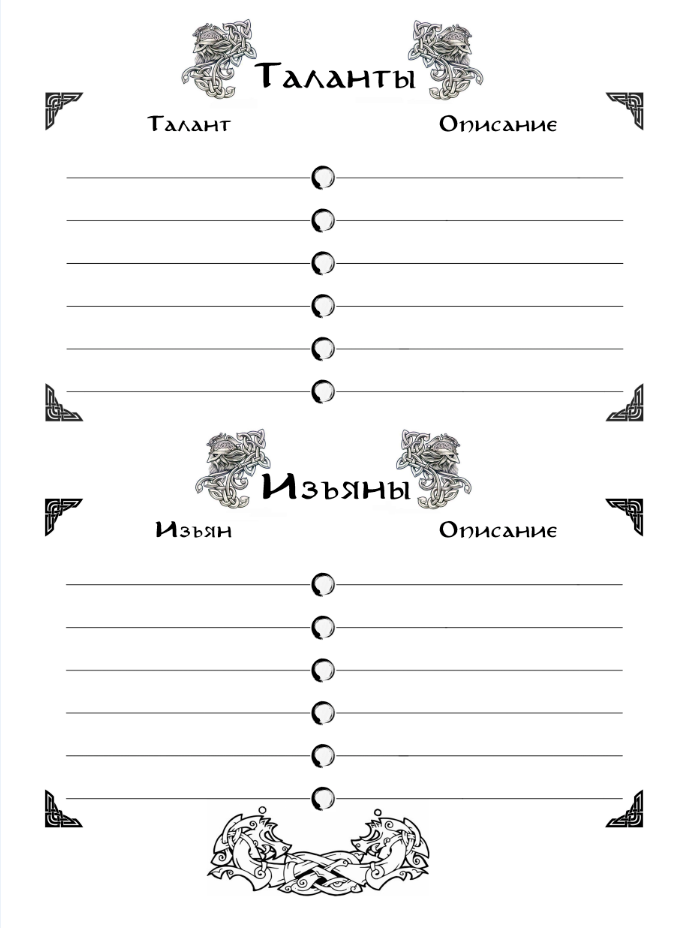

{ .img-float-right }

На результаты действий персонажа так же влияют таланты, врождённые и приобретённые. Получаются таланты при развитии навыков и выполнении соответствующих условий. Нельзя взять талант, который не подходит персонажу по роду деятельности и образу жизни.

Таланты, в отличие от навыков, могут не оказывать прямого влияния на результат броска. Вместо этого они могут влиять на другие возможные модификаторы, позволяя частично или полностью игнорировать штрафы, давать различные бонусы или служить дополнительным модификатором.

Изъяны работают так же, как и таланты, но оказывают негативные эффекты на персонажа.

**Примеры талантов:**

|**Тип**|**Описание**|
|-|---|
|Непобедимый|Удваивает количество ран, необходимых для повышения уровня ранения. По умолчанию имеется у существ крупного размера. _Доступен только персонажам с родом занятий Воин._|
|Устойчивость (алкоголь)|Позволяет игнорировать штраф от модификатора «алкогольное опьянение».|
|Устрашающий|Вид персонажа внушает обычным противникам ужас. Добавляет штраф к броску противника -1 верхней границы.|
|Аскет|Персонаж не получает штрафов и бонусов от модификаторов еды и сна.|
|Храбрый|На персонажа не действуют штрафы Устрашения.|
|Браконьер|Персонаж получает бонусную добычу при успешной охоте.|
|Берсерк|Понижает уровень штрафа от ранений на один уровень. Включает обязательный изъян «Кровожадный».|

**Примеры изъянов:**

|**Тип**|**Описание**|
|-|---|
|Фобия (тип фобии)|В зависимости от типа фобии, персонаж получает штраф к нахождению в устрашающей его местности или к боевым броскам против устрашающего типа противников. При контакте с объектом фобии стресс накапливается вдвое быстрее.|
|Пристрастие (тип вещества)|Персонаж не может обходиться без алкоголя/наркотиков/... . Штрафы от употребления учитываются в двойном размере. Неупотребление предмета зависимости в течение одного дня накладывает постоянный штраф -1 ко всем броскам; в течение трёх дней - постоянный штраф -2 ко всем броскам; в течение недели -3. При неупотреблении в течение месяца, изъян становится неактивным, но возвращается при следующем приёме предмета зависимости.|
|Кровожадный|Персонаж добивает всех поверженных противников.|
|Суеверный|Персонаж стойко придерживается известных ему примет и ритуалов; при их несоблюдении, а также порче или нарушении границ религиозных святынь заполняет шкалу стресса до половины.|
|Дезертир|Находясь в составе организованной группы/отряда/армии, персонаж в бою получает штраф к границам диапазона успеха на все атакующие и оборонительные действия.|