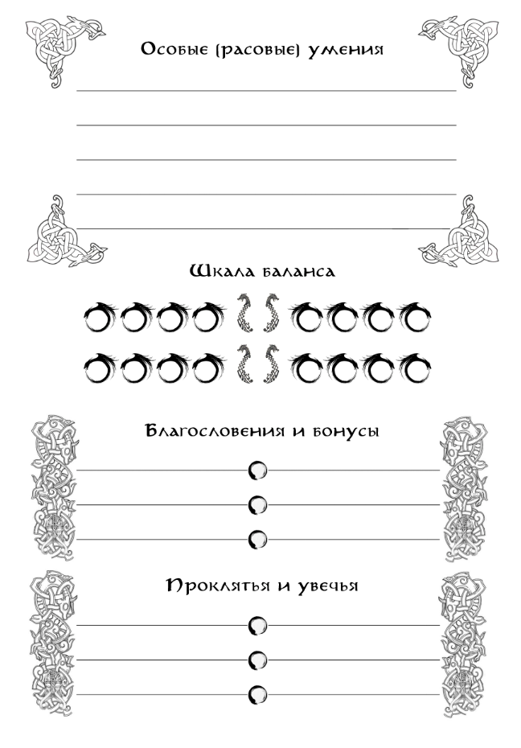

{ .img-float-right }

У каждого персонажа есть особая **Шкала Баланса**, разбитая на 9 ячеек. Она отражает то, как хорошо и как именно персонаж может обращаться со своей расовой особенностью. У каждой расы есть своё пассивное или активное уникальное умение, которое может динамически изменяться в зависимости от характера его применения.

Изначально положение шкалы всегда находится в **Нейтральном (среднем) положении**, которое может иметь свои эффекты, а может не иметь никаких. Применение расовой способности будет заполнять ячейки к одному из крайних положений шкалы, накладывая на персонажа особые бонусы и штрафы.

Ячейки справа от Нейтрального положения называются стороной **Силы**. Как правило, заполнение ячеек Силы происходит при более решительном, агрессивном применении способности, либо при упорном и осознанном её развитии с какой-то определённой узкой целью.

Ячейки слева от Нейтрального положения называются стороной **Устойчивости**. Эта сторона чаще даёт более общие бонусы, и заполняется при более осторожном и пассивном применении расовой способности.

Каждая заполненная ячейка отражает **уровень способности**. Для достижения **первого** уровня нужно всего **одно** успешное применение расового умения. Ещё **два** применения – для достижения **второго** уровня. Ещё **три** – для достижения **третьего**, и ещё **четыре** – для достижения **четвёртого**.

Итого, чтобы довести **Шкалу** до крайнего положения, потребуется **девять** успешных применений расовой способности. А чтобы вывести **Шкалу** из одного крайнего положения к противоположному – **двадцать** применений.

При длительном неиспользовании расовой способности, **Шкала Баланса** начинает смещаться к **Нейтральному положению** (на **одну** ячейку раз в **три** игровых дня). Однако невозможно просто поддерживать её уровень – применение способности должно быть подкреплено условиями, на которые она влияет.

Так, например, способность, дающая устойчивость к холоду, применяется только когда персонаж сталкивается с его пагубным воздействием. Способности, оберегающие от испуга, работают только когда на персонажа оказывают эффект Устрашения. А если расовая способность позволяет достичь боевого неистовства, то и враг должен представлять для персонажа значительную опасность.

На примере уже упомянутых в разделе **«Персонаж»** рас, разберём, как именно работают несколько конкретных **Особых расовых умений**.
***
**Особое (расовое) умение Стеннаров (гномов):** 

Стойкость стеннаров. _"Камень может разбиться, но никогда не сгниёт"._

<u>Действие:</u> Персонаж получает постоянный бонус в виде бесплатного таланта «Устойчивость (болезни, яды)» и возможности нести загрузку существ среднего размера.

Шкала баланса отражает его пассивную сопротивляемость к прямым негативным воздействиям Осквернённого Дара (враждебной магии). 

<u>Сила:</u> даёт сильную устойчивость к определённому виду Осквернённого Дара (+2 на 1 уровне способности, +3 на 2 уровне, +4 на 3 уровне, полным иммунитетом на 4 уровне способности). 

<u>Устойчивость:</u> даёт более слабое сопротивление всем видам Осквернённого Дара (от +1 на 1 уровне, до +4 на 4 уровне).

<u>Изменение Шкалы Баланса</u> происходит исключительно при внешнем воздействии.

**Особое (расовое) умение Ирун (чёрных талгов (орков)):**

Неукротимость ирун. *"Сеет мир тот, кому довелось жать войну".*

<u>Действие:</u> Могут бороться со стрессом, сопротивляться воздействию ужаса и внушать его врагам. Ремесленники-кузнецы ирун более эффективно обрабатывают «Чёрную сталь», создавая вещи с особыми свойствами при Критическом Успехе.

<u>Сила:</u> 1 уровень способности – возможность игнорировать штрафы от стресса один раз за сцену с активными действиями, 2 уровень – добавляется возможность однократно за сцену наложить штрафы от «Устрашения», 3 уровень – стресс восстанавливается вдвое быстрее, 4 уровень – позволяет три раза за сцену наложить эффект «Устрашения». 

<u>Устойчивость:</u> 1 уровень – возможность дважды за сцену проигнорировать штрафы от стресса, 2 уровень – добавляется возможность однократно проигнорировать штрафы от «Устрашения», 3 уровень – стресс накапливается вдвое медленнее, 4 уровень – возможность три раза за сцену проигнорировать штрафы от «Устрашения» и стресса.

<u>Изменение Шкалы Баланса</u> в сторону Силы происходит, если персонаж действует решительно, первым атакует, проявляет инициативу в спорных или сложных ситуациях; в сторону Устойчивости, если персонаж действует с осторожностью и хитростью, больше полагается на навыки защиты и помощь союзников.

**Особое (расовое) умение ульфов:**

Дух Зверя. "Нет Бога чудовищнее Зверя, и народа свирепее его потомства ". 

<u>Действие:</u> Взывают к силе своего Бога, обращаясь в свирепых и чудовищных созданий.
При каждом применении способности персонаж получает временные бонусы талантов «Непобедимый» и «Устрашающий».

<u>Сила:</u> Даёт персонажу дополнительные криты (на уровне 2 – каждая 4, на 3 – каждая 3, на 4 – каждая 2) и Бонус сопротивления штрафам от Осквернённого Дара (на 1, 2 и 3 уровнях +2, на максимальном уровне +4). Проверка на выход из состояния: от 1 до 4 успехов на каждом уровне соответственно. На каждом, более высоком уровне способности персонаж ведёт себя в бою всё более неистово и безрассудно.

<u>Устойчивость:</u> Применение способности требует 2 успеха на 1 уровне, 3 на 2 уровне, 4 на 3 уровне и 4 успеха с хотя бы одной четвёркой на кубах - на 4 уровне способности. Дополнительные криты действуют только на уровне 2 – каждая 4. На уровнях 3-4 дополнительные криты не действуют совсем. Персонаж получает Модификатор сопротивления любым негативным воздействиям +1 на уровне 1-3 и +2 на уровне 4. Проверка на выход из состояния: 2 успеха на уровнях 1-2, 1 успех на уровнях 3-4. 
При провале проверок на выход: Частичном провале – увечье; Полном провале – полная потеря контроля над персонажем.

<u>Изменение Шкалы Баланса</u> в сторону Силы происходит при каждом применении способности, если персонажу угрожает смертельная опасность; в сторону Устойчивости, если персонаж избегает применения способности, когда ему угрожает смертельная опасность.

**Особое (расовое) умение огров:**

Смирение огров. *"Сильны идущие против течения судьбы, Безудержны те, кто сумел его оседлать".* 

<u>Действие:</u> Персонаж получает возможность раз в неделю игрового времени, на любом длительном отдыхе пройти проверку с требованием в 4 успеха на видение возможного, связанного непосредственно с ним будущего.

<u>Сила:</u> может один раз за сцену с активными действиями проигнорировать все штрафы от ранений (на первом уровне способности – лёгких, на втором – средних, на третьем – тяжелых, на четвёртом – состояние «при смерти»). 

<u>Устойчивость:</u> на 1 уровне способности игнорирует штрафы от легких ранений, на 2 уровне не накапливает очки стресса, на 3 уровне получает +1 бонусный модификатор на встречные проверки Навыков равного своему уровня, на 4 уровне получает +2 бонусных модификатора на встречные проверки против Навыков более высокого уровня.

<u>Изменение Шкалы Баланса</u> в сторону Силы происходит, если персонаж провоцирует конфликты, игнорирует ранги и иерархию, берёт инициативу в свои руки; в сторону Устойчивости, если персонаж проявляет пытливость и наблюдательность, а также ставит и достигает целей, которых непросто достичь в одиночку.

**Особое (расовое) умение кирма (серых эйнов (эльфов)):**

Всадники кирма. *"Между землёй и небом – лишь ветер".* 

<u>Сила:</u> на 1 уровне способности бесплатный талант «Всадник», на 2 уровне – +1 бонусный модификатор на проверки навыка «Верховой Бой», на 3 уровне не накапливает усталость при нахождении верхом в боевой ситуации, на 4 уровне на 5 условных единиц увеличивается базовая скорость при передвижении верхом. 

<u>Устойчивость:</u> на 1 уровне способности бесплатный талант «Вольтижер», на 2 уровне получает +1 бонусный модификатор на проверки навыка «Верховая Езда», на 3 уровне получает возможность приручить любое дикое верховое животное раз в 1d6 дней, на 4 уровне увеличивает базовую скорость 5 союзных верховых животных на 2 условные единицы.

<u>Изменение Шкалы Баланса</u> в сторону Силы происходит, если персонаж успешно применяет навыки обращения с верховыми животными в боевых ситуациях; в сторону Устойчивости, если персонаж успешно применяет навыки обращения с верховыми животными вне боя.
***
Также каждому персонажу доступна и **вторая Шкала Баланса**, абсолютно идентичная первой. Она используется в уникальных сюжетных обстоятельствах, когда определённый характер поведения персонажа влияет на некую подконтрольную ему подсистему. Например, в руки персонажу может попасть магическая вещь, применение которой в агрессивном ключе наделит её одними способностями и бонусами, а в мирном – другими.
