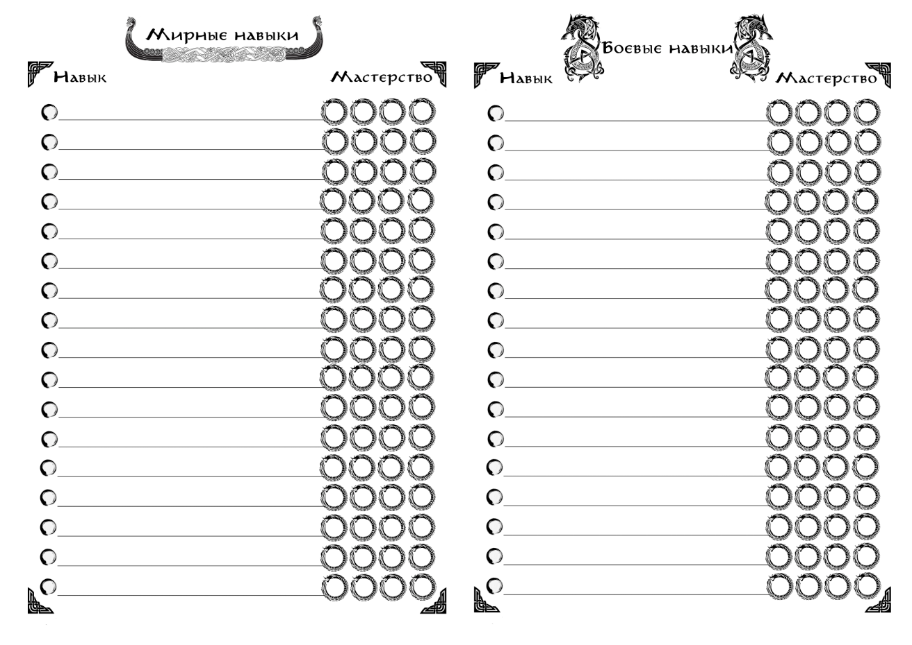

{ .img-center }

**Навыки** – это основной инструмент персонажа в достижении большинства целей, совокупность его знаний, умений и профессиональной подготовки. Отсутствие Навыка не ограничивает персонажа в возможных действиях, однако действие без Навыка в соответствующей области будет требовать абсолютного критического успеха.

У навыков есть **четыре уровня мастерства** – Новичок, Умелец, Профессионал и Мастер. 

**<u>Новичок</u>** требует для Полного Успеха действия **четырёх попаданий** в диапазон, при этом числа **верхней и нижней границы** диапазона **не считаются** успехами.

**<u>Умелец</u>** требует **трёх попаданий**, при этом числа **верхней границы** диапазона **считаются** успехом. 

**<u>Профессионал</u>** требует **двух попаданий**, **учитывая** числа **и верхней, и нижней границы**. 

**<u>Мастер</u>** требует хотя бы **одного попадания** в диапазон, при этом **любая** выброшенная **четвёрка считается** попаданием.

У каждого Навыка есть своя стоимость в условных **«Очках Навыков» (ОН)**, за которые навык «покупается» при генерации. Получение и развитие Навыков внутри игры происходит при их активном использовании. Прогресс навыка считается в тех же «Очках Навыков», при этом каждый следующий уровень мастерства требует большей практики и большего количества накопленных очков.

Чтобы освоить новый Навык на уровне «Новичка», необходимо **накопить 10 ОН**. Развитие до уровня «Умельца» потребует **20 ОН**. Уровень «Профессионала» обойдётся ещё в **25 ОН**. И, наконец, чтобы достигнуть уровня «Мастера» необходимо будет накопить **40 ОН**.

При обучении новому Навыку до уровня «Новичка» и его развитии до уровня «Умельца» начисляется **2 ОН** за его успешные применения, и по **1 ОН** за провалы. Развитие Навыков до уровней «Профессионал» и «Мастер» приносит **1 ОН** только за успешные применения.

Навыки делятся на два вида: **Мирные** и **Боевые**. При генерации даётся **15 ОН** на мирные навыки и **10 ОН** на боевые навыки. Уровень стартового мастерства определяется <u>сложной проверкой</u> 4d6 в диапазон 2d6 для мирных, и <u>встречной проверкой</u> 4d6 против 2*2d6, где второй бросок является условным уровнем встреченных противников – для боевых. 

Заявленный навык не может быть меньше уровня «Новичка», то есть при полном провале останется базовый уровень навыка, и при генерации не может быть получен уровень «Мастера», если иное не предусмотрено легендой персонажа.

И в Мирных, и в Боевых навыках есть категории Общих навыков, доступных всем персонажам по стандартной стоимости, и Обязательных навыков, доступных по сниженной стоимости персонажам с соответствующим Родом занятий.

Обязательные Навыки, соответствующие выбранному Роду занятий, требуют меньше ОН для достижения последних двух уровней мастерства – 20 и 35 соответственно. Это относится и к выбранным при создании персонажа, и к тем, что стали осваиваться уже в процессе игры.

**Примеры мирных навыков**

|**Название**|**Категория**|**Цена**|**Описание**|
|-|--------|---|---|
|Алхимия|Обязательный|5 (4)|Позволяет создавать новые алхимические составы: мази, зелья, яды, технические смеси.|
|Травничество|Общий|1|Поиск, сбор и обработка растений.|
|Экстракция|Обязательный|3 (2)|Извлечение и обработка ингредиентов животного происхождения.|
|Верховая езда |Обязательный|3 (2)|Позволяет управлять верховыми животными соответствующего размера.|
|Езда на верховых платформах|Общий|4|Позволяет управлять крупными и огромными верховыми животными с верховой платформы.|
|Первая помощь|Общий|2|Позволяет стабилизировать Ранения, выводить из состояния «При Смерти» и исцелять Лёгкие Раны.|
|Медицина |Обязательный |5 (4)|Персонаж может проводить сложные операции, лечить любые ранения и увечья, применять сложные алхимические составы при исцелении.|
|Выживание|Общий|2|Включает в себя умение рыбачить, находить подножный корм, разжигание костров и заготовку угля, создание импровизированных убежищ и плавание. |
|Атлетика|Общий|2|Наделяет персонажа хорошей физической формой, позволяет дольше и быстрее бегать и плавать, лучше лазать и переносить тяжелые условия.|
|Командование|Обязательный|4 (3)|Наделяет персонажа лидерскими качествами, позволяет успешно разрешать спорные ситуации внутри отряда, уменьшить получаемый отрядом стресс и эффективнее применять его в различных ситуациях.|

**Примеры боевых навыков**

|**Название**|**Категория**|**Цена**|**Описание**|
|-|--------|---|---|
|Владение древковым колющим|Обязательный|2 (1)|Персонаж умеет обращаться с двуручным колющим оружием на длинном древке. Уровни навыка 3-4 дают бонус против крупных и огромных существ, а также верховых противников, убирая нижнюю и верхнюю границы диапазона сопротивления.|
|Владение одноручным дробящим|Обязательный|2 (1)|Персонаж умеет обращаться с одноручными дубинами, булавами, цепами, молотами и прочими видами ударно-дробящего оружия. Уровни навыка 3-4 дают бонус против врагов, носящих броню, убирая нижнюю и верхнюю границы диапазона сопротивления.|
|Бой на верховых платформах|Общий|4|Персонаж может сражаться с верховых платформ, использующихся вместо сёдел на существах большого размера. Требует «Езды на верховых платформах».|
|Управление военными машинами|Обязательный|5 (4)|Персонаж может управлять отрядом в бою. Позволяет сократить потери среди бойцов и повысить их эффективность.|
|Тактика|Обязательный|5 (4)|Персонаж может управлять отрядом в бою. Позволяет сократить потери среди бойцов и повысить их эффективность.|
|Метание|Общий|2|Персонаж может эффективно швырять подручные предметы в бою.|