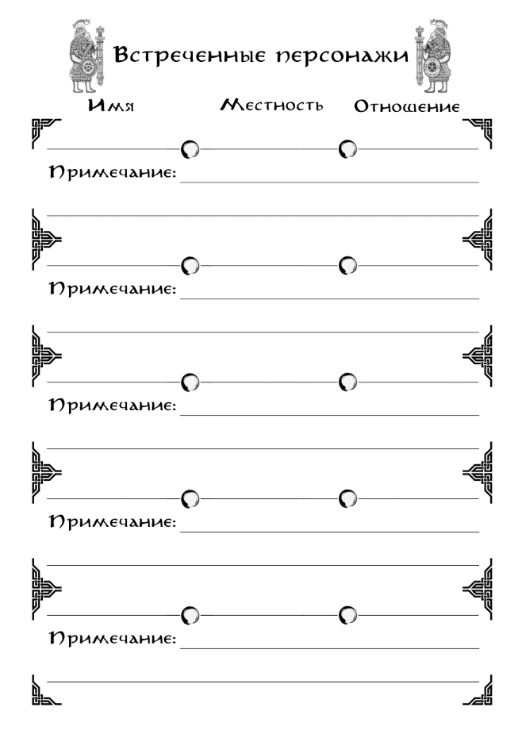

{ .img-float-right }

### Переговоры.

В системе нет навыков, напрямую влияющих на общение между персонажами вне сферы их профессиональных знаний. Никакого персонажа невозможно убедить в чем-либо с помощью механического броска кубов.

Для подобного действия необходимо подготовить соответствующие **Аргументы** и **Стратегию** убеждения. И в их подготовке уже могут косвенно помочь другие сопутствующие Навыки. Но и они могут не потребоваться. Почти во всех случаях, любое социальное взаимодействие может разрешиться в пользу персонажей игроков, если они верно подобрали Аргументы и Стратегию к целевому персонажу.

**Аргументы** – это некая фактическая информация, напрямую затрагивающая целевого персонажа и суть взаимодействия с ним.

**Стратегия** – это линия поведения, которой персонажи игроков придерживаются при взаимодействии с целевым персонажем.

Оба этих ключевых элемента социального взаимодействия можно подготовить, тщательно изучая локации, на которых происходит действие, и связанных с ним персонажей. Как и у любого противника в бою, у социальных оппонентов тоже есть свои сильные и слабые стороны, и к любому из них можно подобрать свои рычаги воздействия. Каким-то будет достаточно определённых Черт характера персонажей, других нужно будет припугнуть, а кому-то потребуется оказать услугу.

**Пример.** _«Два наемных егеря договорились с начальником заставы за награду выследить и убить шорбала - монструозного хищного вепря. Однако, настигнув цель, егеря обнаружили вместе с шорбалом и его выводок - трёх довольно крупных и уже опасных детёнышей. Если егеря прямиком направились выполнять задание, и, проявив изрядное мастерство, выполнили его, а после также прямиком вернулись к нанимателю обратно, то никакие их уговоры, угрозы и требования не заставят начальника изменить их награду в связи с изменением уровня опасности._

_Ведь, задержись егеря на заставе, пообщавшись с местными, они бы выяснили, что начальник – чудовищный скряга. И что больше непредвиденных расходов он ненавидит только упущенную выгоду. Так они могли бы узнать Стратегию – давление на скупость._

_А изучив местность внимательнее, егеря нашли бы брошенные лагеря лесорубов и углежогов, что обеспечило бы их стратегию Аргументами - прямой ущерб выгоде нанимателя._

_Подготовившись к переговорам, таким образом, егерям без труда удалось бы добиться увеличения награды. А владение Навыком "Торговли" любого уровня позволило бы сделать надбавку ещё чуть более существенной»._

Стратегию и Аргументы можно попытаться определить наугад, исходя из уже доступных видимых деталей в окружении и поведении целевого персонажа. Однако неудачная попытка ухудшит его **Отношение**, что приведет к негативным последствиям и может существенно осложнить взаимодействие с ним.

### Отношения.

Существует несколько уровней **Отношений** между персонажами. Большинство относится друг к другу **Нейтрально**, что не даёт никаких преимуществ, но и не создаёт никаких сложностей.

**Ухудшение Отношений** ведёт к уровням **Неприязнь, Вражда и Ненависть**. 

Персонажи, относящиеся друг к другу с **Неприязнью** способны на полноценное взаимодействие, хотя и не будут от него в восторге. Они будут стремиться поддеть друг друга, утаивать важную информацию, задирать цены на товары и тому подобное.

**Враждующие** персонажи станут вступать в диалог лишь в случае крайней нужды. Они будут всячески стараться избегать социальных контактов друг с другом, примутся сыпать оскорблениями при встрече и легко перейдут к насилию в случае провокации.

Персонажи, **Ненавидящие** друг друга, вовсе не станут тратить времени на разговоры. Едва завидев предмет своей ненависти, они немедленно схватятся за оружие, и от сиюминутного насилия откажутся только в том случае, если у них в запасе есть более надёжный план расправы.

**Улучшение Отношений** ведёт к уровням **Симпатия, Союз, Друг и Родич.**

**Симпатизирующие** друг другу персонажи будут охотно вступать в диалог, легко закроют глаза на мелкие проступки, поделятся ценными сведениями и уступят товар по более выгодной цене. Однако такие персонажи не станут рисковать собой и своими интересами друг ради друга.

**Союзники** же с готовностью пойдут на такой риск. Они окажут помощь в случае беды, встанут плечом к плечу в битве и окажут любую посильную поддержку даже без прямой для себя выгоды. Но Союз – это равные Отношения, требующие отдачи с обеих сторон. Командир должен быть верен своим воинам, чтобы они рисковали жизнью по его приказу, а торговые партнёры – делать широкие и доверительные жесты, чтобы обеспечить это самое доверие.

**Друзья** – более терпимы. Они без раздумий встанут на защиту друг друга даже перед лицом превосходящих сил врага, поделятся последним глотком из фляги и будут отстаивать дружеские интересы и цели, даже если сами не вполне их понимают. Единственное, чего не потерпит Друг – это предательства.

**Родичи** – это ближайшая семья персонажа, не только по крови, но и по духу. Они без колебаний пожертвуют жизнью ради его спасения, встанут рядом с ним против всего мира. Станут ради него лгать, предавать и убивать, если это будет необходимо. Разорвать такие узы чрезвычайно сложно.

Все уровни **Отношений**, кроме «Родича», в равной степени распространяются как на взаимоотношения между отдельными персонажами, так и между Фракциями.
